# INT26-20 — AWS Full Stack: VPC → EC2 → Nginx → S3 → Domain → SSL

---

## Зміст

- [Архітектура](#архітектура)
- [Крок 1 — VPC](#крок-1--vpc)
- [Крок 2 — EC2 + SG + Elastic IP](#крок-2--ec2--sg--elastic-ip)
- [Крок 3 — S3 + IAM Role + User Data + Nginx](#крок-3--s3--iam-role--user-data--nginx)
- [Крок 4 — Domain + A Record + SSL](#крок-4--domain--a-record--ssl)
- [Definition of Done](#definition-of-done)
- [Файлова структура](#файлова-структура)

---

## Архітектура

```
Internet
    │
    ▼
Internet Gateway (internship2026-igw)
    │
    ▼
┌─────────────────────────────────────────────────┐
│              VPC: internship2026-vpc             │
│                  10.0.0.0/16                     │
│                                                  │
│  ┌──────────────┐      ┌──────────────┐          │
│  │  public-1a   │      │  public-1b   │          │
│  │ 10.0.0.0/24  │      │ 10.0.1.0/24  │          │
│  │              │      │              │          │
│  │  EC2 (Nginx) │      │              │          │
│  │ EIP:100.56.. │      │              │          │
│  │      +       │      │              │          │
│  │  NAT Gateway │      │              │          │
│  │ EIP:3.88..   │      │              │          │
│  └──────────────┘      └──────────────┘          │
│                                                  │
│  ┌──────────────┐      ┌──────────────┐          │
│  │  private-1a  │      │  private-1b  │          │
│  │ 10.0.10.0/24 │      │ 10.0.11.0/24 │          │
│  └──────────────┘      └──────────────┘          │
└─────────────────────────────────────────────────┘
```

---

## Крок 1 — VPC

**Мета:** Створити ізольовану приватну мережу з повним розподілом трафіку між публічними та приватними підмережами.

### Створені ресурси

| Ресурс | Назва / ID | Параметри |
|---|---|---|
| VPC | `internship2026-vpc` | CIDR: `10.0.0.0/16`, tag: `environment=prod` |
| Subnet | `public-1a` | `10.0.0.0/24`, AZ: `us-east-1a`, Auto-assign IPv4: ✅ |
| Subnet | `public-1b` | `10.0.1.0/24`, AZ: `us-east-1b`, Auto-assign IPv4: ✅ |
| Subnet | `private-1a` | `10.0.10.0/24`, AZ: `us-east-1a` |
| Subnet | `private-1b` | `10.0.11.0/24`, AZ: `us-east-1b` |
| Internet Gateway | `internship2026-igw` | Attached до `internship2026-vpc` |
| NAT Gateway | `internship2026-nat` | Public, AZ: `us-east-1a`, EIP: `3.88.120.19` |
| Route Table | `public-rt` | `0.0.0.0/0` → IGW; associated: `public-1a`, `public-1b` |
| Route Table | `private-rt` | `0.0.0.0/0` → NAT; associated: `private-1a`, `private-1b` |

### Чому дві підмережі кожного типу?

Два публічних і два приватних сабнети у різних Availability Zones (`us-east-1a`, `us-east-1b`) забезпечують **High Availability** — при падінні однієї зони сервіси автоматично залишаються доступними через іншу.

### Чому NAT Gateway у публічній підмережі?

NAT Gateway сам потребує виходу в інтернет через Internet Gateway. Він транслює вихідний трафік приватних машин через свою Elastic IP, але зворотний трафік (з інтернету в приватну мережу) — неможливий.

### Підтвердження

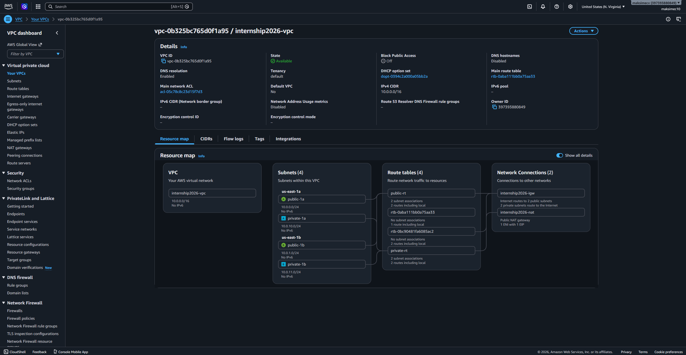

---

## Крок 2 — EC2 + SG + Elastic IP

**Мета:** Запустити веб-сервер у публічній підмережі зі статичною IP-адресою та правильно обмеженими портами.

### Security Group `web-sg`

| Тип | Порт | Протокол | Джерело | Обґрунтування |
|---|---|---|---|---|
| SSH | 22 | TCP | My IP | Доступ лише з авторизованої мережі |
| HTTP | 80 | TCP | `0.0.0.0/0` | Необхідний для Let's Encrypt validation та редіректу на HTTPS |
| HTTPS | 443 | TCP | `0.0.0.0/0` | Основний захищений трафік |

### EC2 Instance

| Параметр | Значення |
|---|---|
| Name | `internship2026-ec2` |
| AMI | Amazon Linux 2023 |
| Instance type | `t3.micro` |
| Subnet | `public-1a` (`10.0.0.0/24`) |
| Security Group | `web-sg` |
| Elastic IP | `100.56.26.96` |
| IAM Role | `ec2-s3-dev-role` |

> **Навіщо Elastic IP?** Тимчасова публічна IP, яка видається через Auto-assign, змінюється після кожного перезапуску інстансу. Elastic IP — це постійна адреса, на яку безпечно вказує DNS-запис домену.

### Перевірка SSH

```bash
chmod 400 my-key.pem
ssh -i my-key.pem ec2-user@100.56.26.96
```

### Підтвердження

| Скріншот | Опис |
|---|---|
| 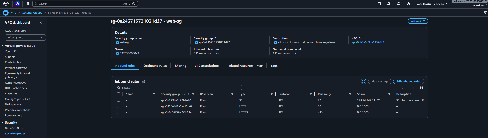 | Налаштування inbound-правил Security Group `web-sg` |
| 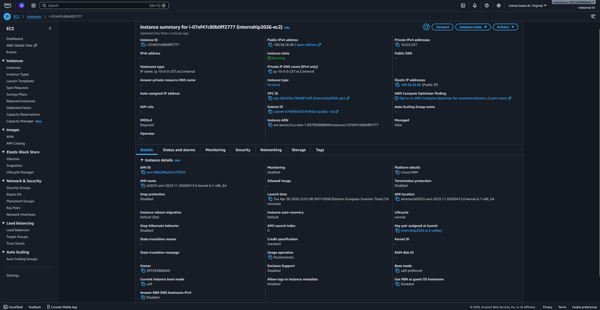 | Запущений інстанс у стані `running` |
| 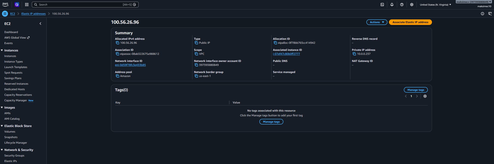 | Elastic IP `100.56.26.96` прив'язана до інстансу |
| 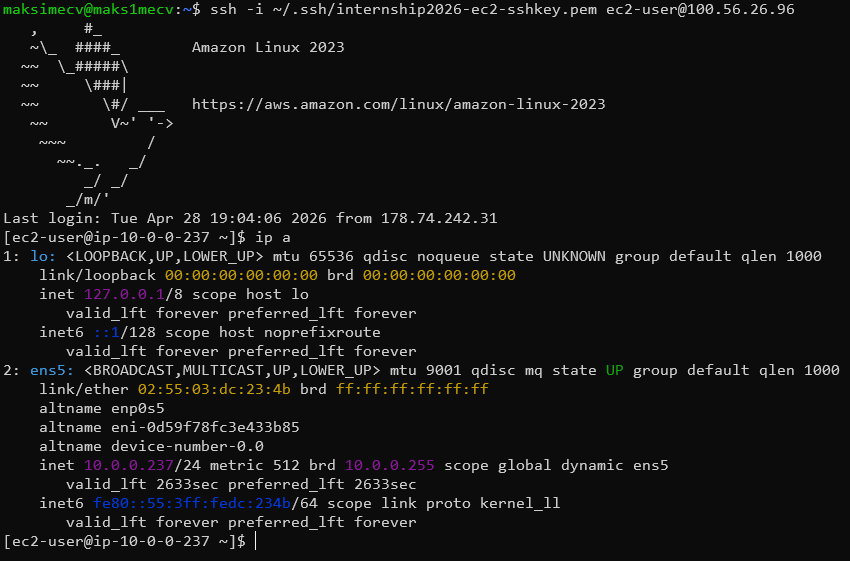 | Успішне підключення по SSH |

---

## Крок 3 — S3 + IAM Role + User Data + Nginx

**Мета:** Автоматизувати деплой веб-сервера через User Data: при першому запуску EC2 встановлює Nginx і завантажує файли з S3.

### S3 Bucket

| Параметр | Значення |
|---|---|
| Bucket name | `dev-maksimecv-8828` |
| Region | `us-east-1` |
| Tag | `environment=dev` |
| Public access | Заблоковано (доступ лише через IAM Role) |

**Завантажені об'єкти:**
- `index.html` — кастомна сторінка з інтерактивною 3D-сценою (Three.js / WebGL)
- `*.sh` — bash-скрипти з Linux-лекції

### IAM Policy `ec2-s3-dev-readonly`

```json
{
    "Version": "2012-10-17",
    "Statement": [
        {
            "Effect": "Allow",
            "Action": [
                "s3:GetObject",
                "s3:ListBucket"
            ],
            "Resource": [
                "arn:aws:s3:::dev-*",
                "arn:aws:s3:::dev-*/*"
            ]
        }
    ]
}
```

> Префікс `dev-*` у `Resource` обмежує доступ виключно до бакетів із середовища `dev`. Спроба звернутися до будь-якого іншого бакету (наприклад, `prod-*`) завершиться помилкою `AccessDenied`.

Повний JSON: [`ec2-s3-dev-readonly.json`](step3/ec2-s3-dev-readonly.json)

### IAM Role `ec2-s3-dev-role`

- **Trusted entity:** `AWS Service → EC2`
- **Attached policy:** `ec2-s3-dev-readonly`
- **Прикріплена до EC2** через `Actions → Security → Modify IAM role`

### User Data Script

Скрипт виконується **одноразово** при першому завантаженні інстансу.

```bash
#!/bin/bash
yum update -y
yum install -y nginx
systemctl enable --now nginx

mkdir -p /home/ec2-user/scripts
aws s3 cp s3://dev-maksimecv-8828/index.html /usr/share/nginx/html/index.html --region us-east-1
aws s3 cp s3://dev-maksimecv-8828/ /home/ec2-user/scripts/ --recursive --exclude "*.html" --region us-east-1

chown -R ec2-user: /home/ec2-user/scripts
chmod +x /home/ec2-user/scripts/*.sh
systemctl restart nginx
```

Повний (модифікований) скрипт: [`user_data.sh`](step3/user_data.sh)

### Перевірка

```bash
# HTML-сторінка повертається з сервера
curl https://maksimecv.pp.ua

# Bash-скрипти присутні на машині
ls -l /home/ec2-user/scripts/
```

### Підтвердження

| Скріншот | Опис |
|---|---|
| 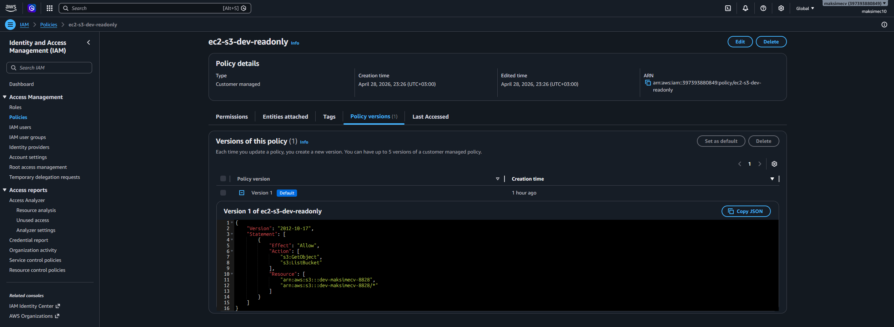 | Створена IAM Policy `ec2-s3-dev-readonly` |
| 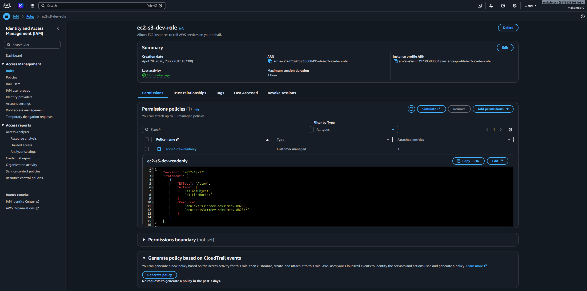 | IAM Role `ec2-s3-dev-role` прикріплена до EC2 |
| 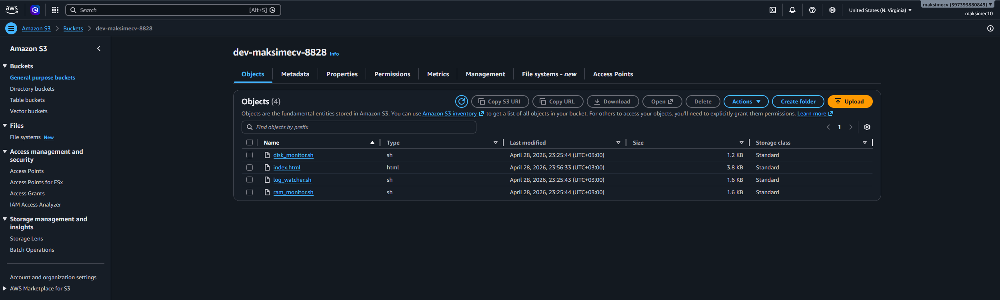 | Файли в S3 бакеті |
| 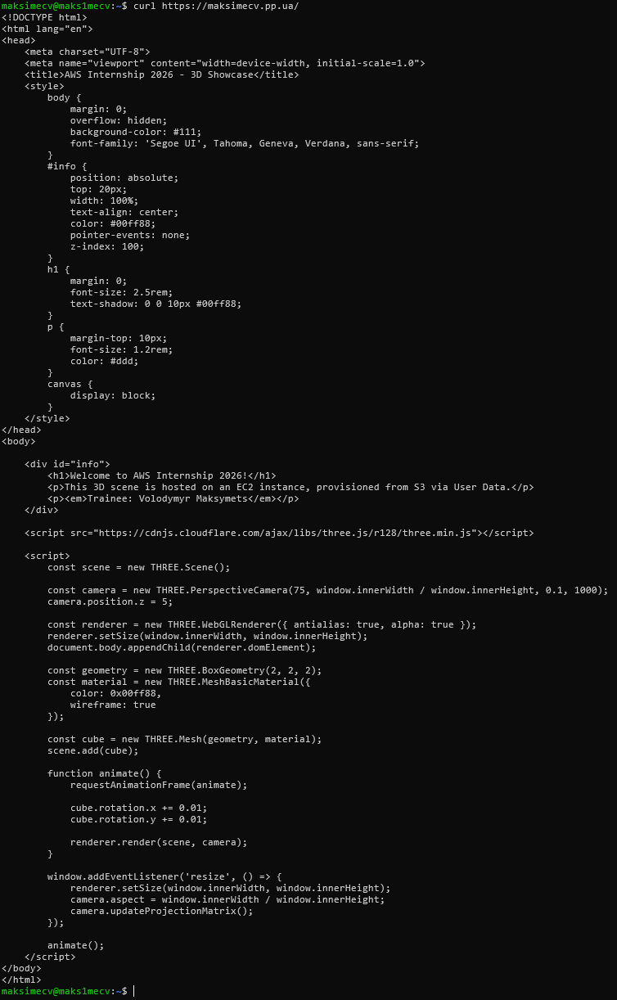 | Відповідь сервера на `curl https://maksimecv.pp.ua` |
| 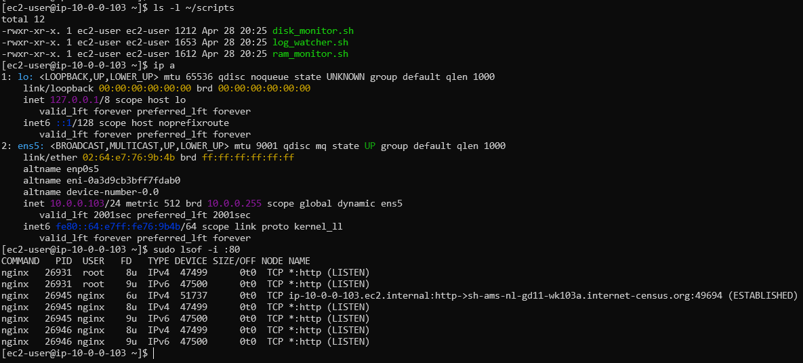 | Bash-скрипти у `/home/ec2-user/scripts/` |
| 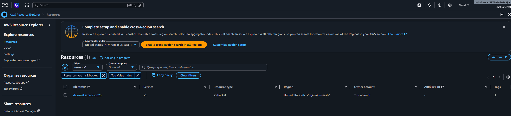 | AWS Resource Explorer: фільтрація ресурсів за тегом `environment=dev` |

---

## Крок 4 — Domain + A Record + SSL

**Мета:** Прив'язати власний домен до сервера та отримати валідний TLS-сертифікат від Let's Encrypt.

### Route 53 — A Record

| Параметр | Значення |
|---|---|
| Hosted Zone | `pp.ua` |
| Record name | `maksimecv.pp.ua` |
| Record type | `A` |
| Value | `100.56.26.96` |
| TTL | `300` |

### Перевірка DNS propagation

```bash
dig maksimecv.pp.ua
```

### SSL через Certbot

```bash
sudo yum install -y certbot python3-certbot-nginx
sudo certbot --nginx -d maksimecv.pp.ua
sudo certbot renew --dry-run
```

Certbot автоматично модифікує конфігурацію Nginx: додає `ssl_certificate`, `ssl_certificate_key` і налаштовує редірект `HTTP → HTTPS`.

Конфігурація Nginx після видачі сертифіката: [`nginx.conf`](step4/nginx.conf)

### Фінальна перевірка

```
https://maksimecv.pp.ua  →  HTML сторінка + 🔒 валідний сертифікат Let's Encrypt
```

### Підтвердження

| Скріншот | Опис |
|---|---|
| 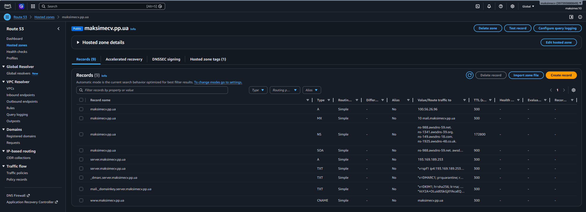 | Налаштована Hosted Zone з A-записом |
| 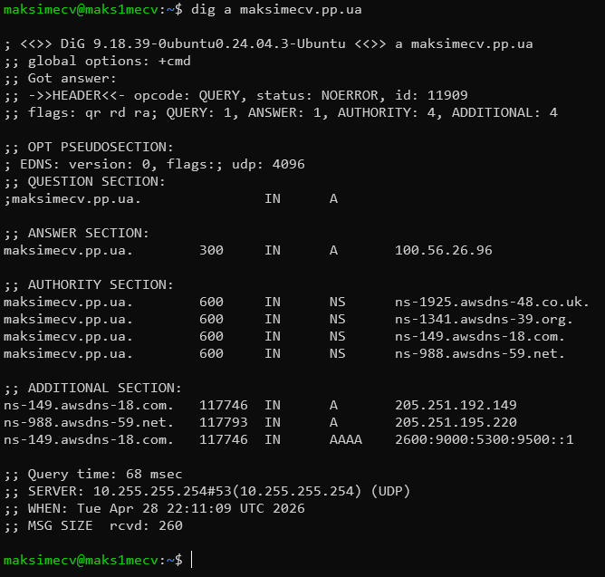 | Перевірка оновлення DNS-зони |
| 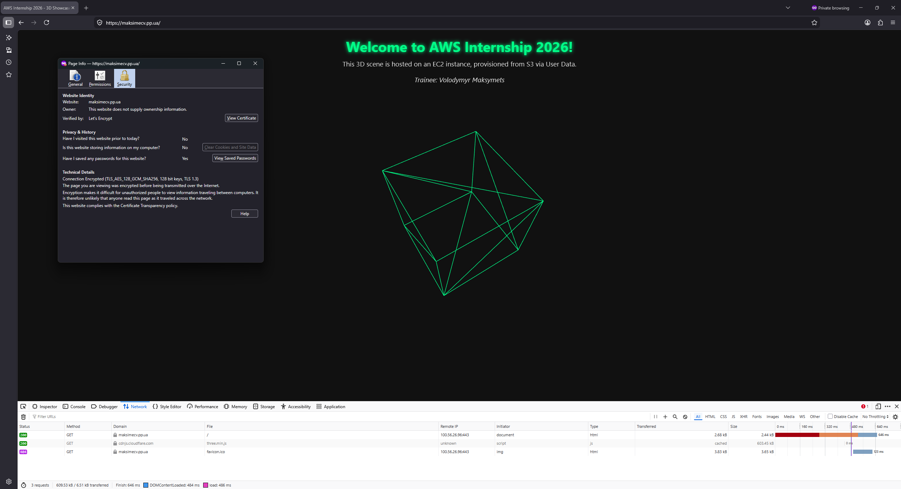 | HTTPS + зелений замок у браузері |

---

## Definition of Done

- [x] VPC з 4 subnets, IGW, NAT Gateway, Route Tables
- [x] EC2 запущена з Elastic IP, SSH працює
- [x] `https://maksimecv.pp.ua` відкриває HTML-сторінку з 3D-сценою
- [x] Bash-скрипти присутні на машині в `/home/ec2-user/scripts/`
- [x] A-record налаштований, домен `maksimecv.pp.ua` резолвиться
- [x] HTTPS працює, сертифікат валідний (Let's Encrypt)
- [ ] Cleanup: видалити NAT Gateway і Elastic IP після завершення
- [ ] ⭐ GCP: повторити архітектуру
- [ ] ⭐ Azure: повторити архітектуру

---

## Файлова структура

```
aws/
├── step1/
│   └── VPC_resource_map.png                              # Resource Map зі всіма компонентами VPC
├── step2/
│   ├── security_group.png                                # Inbound-правила Security Group web-sg
│   ├── ec2_instance.png                                  # EC2 інстанс у стані running
│   ├── associated_ip.png                                 # Elastic IP прив'язана до інстансу
│   └── check_ssh_connection_to_ec2.png                   # Успішне SSH-підключення
├── step3/
│   ├── ec2-s3-dev-readonly.json                          # JSON IAM Policy
│   ├── user_data.sh                                      # User Data скрипт
│   ├── IAM_policy_for_s3.png                             # Скріншот IAM Policy
│   ├── IAM_role_for_s3.png                               # Скріншот IAM Role
│   ├── objects_in_created_s3.png                         # Файли в S3 бакеті
│   ├── curl_results.png                                  # curl https://maksimecv.pp.ua
│   ├── cmd_ls_results.png                                # ls /home/ec2-user/scripts/
│   └── aws_resourse_explorer_filter_by_dev_and_s3.png   # Resource Explorer filter
└── step4/
    ├── nginx.conf                                        # Конфігурація Nginx після Certbot
    ├── route53_dns_zone.png                              # Hosted Zone з A-записом
    ├── cmd_dig_results.png                               # dig maksimecv.pp.ua
    └── browser_results.png                               # HTTPS + зелений замок у браузері
```
