# INT26-24 — Dockerized Monitoring + CMS у Docker Compose

---

## Зміст

- [Архітектура](#архітектура)
- [Крок 1 — Моніторинговий контейнер](#крок-1--моніторинговий-контейнер)
- [Крок 2 — CMS у Docker Compose](#крок-2--cms-у-docker-compose)
- [Крок 3 — Multi-Stage Build (Advanced)](#крок-3--multi-stage-build-advanced)
- [Крок 4 — Self-Hosted Registry (Advanced)](#крок-4--self-hosted-registry-advanced)
- [Розгортання для перевірки](#розгортання-для-перевірки)
- [Definition of Done](#definition-of-done)
- [Файлова структура](#файлова-структура)

---

## Архітектура

```
Internet
    │
    ▼
┌─────────────────────────────────┐
│        nginx-proxy (80/443)     │  ← nginxproxy/nginx-proxy:1.6
│   + acme-companion (Let's Enc.) │  ← nginxproxy/acme-companion:2.4
└────────────┬────────────────────┘
             │  routes by VIRTUAL_HOST
             ▼
      bookstore-nginx
      (nginx:alpine)
             │
    ┌────────┴─────────────────────────────────┐
    │                                          │
    ▼                                          ▼
frontend (Node.js/Express)          admin-fpm (PHP-FPM 8.3)
    │
    ├── catalog-service (FastAPI / Python) → PostgreSQL
    ├── order-service (Node.js/Express)    → PostgreSQL
    └── login-service (FastAPI / Python)   → PostgreSQL + Redis

Background:
    monitoring (Alpine 3.21 + supervisord)
        ├── disk_monitor_worker   [every 60 s]
        ├── ram_monitor_worker    [every 60 s]
        └── log_watcher           [continuous tail]
```

---

## Крок 1 — Моніторинговий контейнер

**Мета:** Перенести bash-скрипти з попереднього ДЗ у Docker Image. Один контейнер запускає всі три скрипти, логи зберігаються у named volume, контейнер автоматично стартує після рестарту.

### Чому не systemd?

`systemd` є PID 1 у systemd-based Linux, але всередині Docker PID 1 — це процес контейнера. Запустити `systemctl` у стандартному контейнері без `--privileged` та спеціального образу — неможливо.

**Обраний підхід:** `supervisord` — легкий Unix-менеджер процесів, стандартне рішення для запуску кількох процесів у Docker без systemd.

### Структура monitoring/

```
monitoring/
├── Dockerfile
├── supervisord.conf
├── disk_monitor.sh
├── ram_monitor.sh
├── log_watcher.sh
├── disk_monitor_worker.sh
└── ram_monitor_worker.sh
```

### Dockerfile

```dockerfile
FROM alpine:3.21
RUN apk add --no-cache bash procps supervisor
COPY *.sh /scripts/
COPY supervisord.conf /etc/supervisord.conf
RUN chmod +x /scripts/*.sh
CMD ["/usr/bin/supervisord", "-c", "/etc/supervisord.conf"]
```

### supervisord.conf

```ini
[supervisord]
nodaemon=true
logfile=/dev/null

[program:disk_monitor_worker]
command=/scripts/disk_monitor_worker.sh
autostart=true
autorestart=true
stdout_logfile=/var/log/monitor/disk_monitor.log

[program:ram_monitor_worker]
command=/scripts/ram_monitor_worker.sh
autostart=true
autorestart=true
stdout_logfile=/var/log/monitor/ram_monitor.log

[program:log_watcher]
command=/scripts/log_watcher.sh
autostart=true
autorestart=true
stdout_logfile=/var/log/monitor/email_notifications.log
```

### Як читаються метрики хоста

| Метрика | Спосіб | Пояснення |
|---|---|---|
| Disk | `df -P /hostfs` | `/hostfs` — bind mount хостового `/` в режимі `ro` |
| RAM | `cat /host_proc/meminfo` | `/host_proc` — bind mount хостового `/proc` в режимі `ro` |

Без цих mount-ів `df` і `free` показували б ресурси лише контейнера, а не фізичного хоста.

### Фрагмент docker-compose.yml

```yaml
monitoring:
  build: ./monitoring
  container_name: monitoring
  restart: unless-stopped
  volumes:
    - /:/hostfs:ro
    - /proc:/host_proc:ro
    - monitor_logs:/var/log/monitor
```

### Підтвердження

| Скріншот | Опис |
|---|---|
| 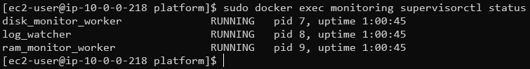 | `docker exec monitoring supervisorctl status` — три процеси RUNNING |
| 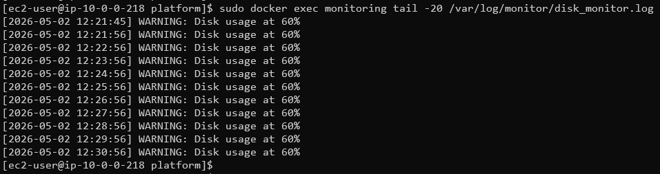 | `tail /var/log/monitor/disk_monitor.log` — метрики хостового диску |
| 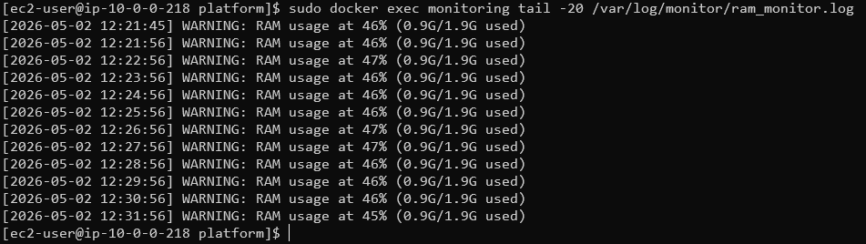 | `tail /var/log/monitor/ram_monitor.log` — метрики хостової RAM |
| 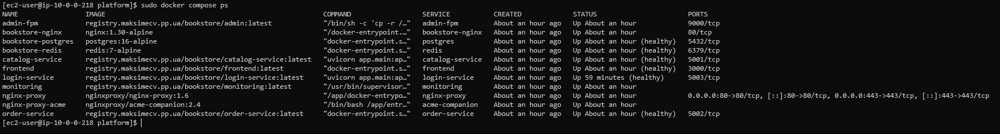 | `docker compose ps` — контейнер `Up` після `docker compose up -d` |

---

## Крок 2 — CMS у Docker Compose

**Мета:** Повноцінний застосунок з кількох контейнерів через Docker Compose. Дані зберігаються у named volumes і не губляться після `docker compose down`.

### Стек сервісів

| Сервіс | Образ / Runtime | Призначення |
|---|---|---|
| `frontend` | Node.js 20 + Express + EJS | Каталог книг та оформлення замовлень |
| `catalog-service` | Python 3.12 + FastAPI | CRUD для книг, кешування через Redis |
| `order-service` | Node.js 20 + Express | Управління замовленнями |
| `login-service` | Python 3.12 + FastAPI | Реєстрація, логін, JWT |
| `admin-fpm` | PHP 8.3-FPM | Адмін-панель через FastCGI |
| `bookstore-nginx` | nginx:alpine | Внутрішній reverse proxy |
| `postgres` | postgres:16-alpine | Спільна БД для всіх сервісів |
| `redis` | redis:7-alpine | Сесії та кеш |
| `nginx-proxy` | nginxproxy/nginx-proxy:1.6 | TLS termination, автовіртуальні хости |
| `acme-companion` | nginxproxy/acme-companion:2.4 | Let's Encrypt автовидача та оновлення |
| `monitoring` | alpine:3.21 + supervisord | Моніторинг хостових ресурсів |

### Named Volumes

```yaml
volumes:
  db_data:       # PostgreSQL data — не губиться після docker compose down
  redis_data:    # Redis AOF persistence
  monitor_logs:  # Логи моніторингу
  nginx_certs:   # TLS сертифікати
  nginx_conf:
  nginx_vhost:
  nginx_html:
  acme:
```

### .env / .env.example

```bash
# .gitignore:
.env

# У репозиторії тільки:
.env.example    # всі змінні з placeholder-значеннями
```

### Підтвердження

| Скріншот | Опис |
|---|---|
| 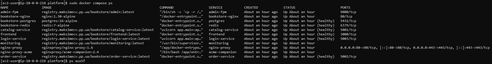 | Всі контейнери `Up (healthy)` після `docker compose up -d` |
| 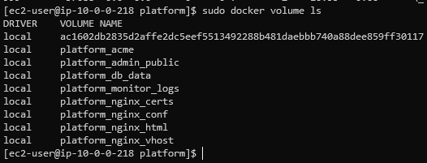 | `docker volume ls` — named volumes після підняття стеку |
| 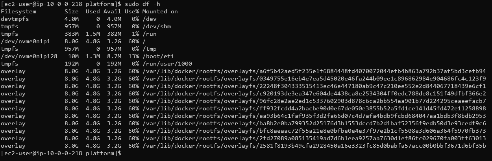 | `df -h` — overlay-файлові системи Docker |
| 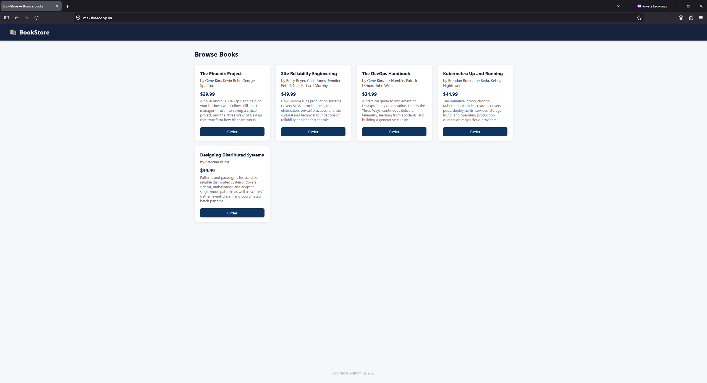 | Застосунок доступний у браузері по HTTPS |
| 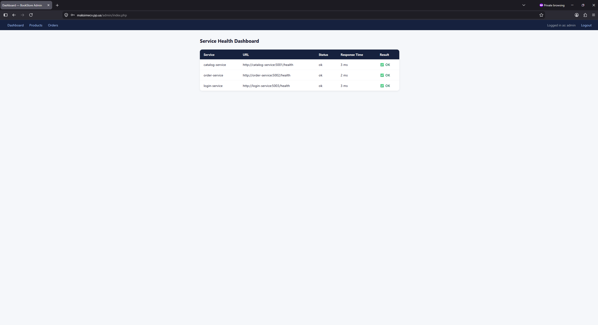 | PHP адмін-панель `/admin` |

---

## Крок 3 — Multi-Stage Build (Advanced)

**Мета:** Зменшити розмір Docker Images, розділивши стадії збірки та runtime.

### Підхід по типу сервісу

**Node.js** (`frontend`, `order-service`) — окрема стадія `deps` для `npm ci`, у runtime копіюється лише `node_modules`:

```dockerfile
FROM node:20-alpine AS deps
WORKDIR /app
COPY package*.json ./
RUN npm ci --only=production && npm cache clean --force

FROM node:20-alpine AS runtime
WORKDIR /app
RUN addgroup -S appgroup && adduser -S appuser -G appgroup
COPY --from=deps /app/node_modules ./node_modules
COPY src/ ./src/
USER appuser
EXPOSE 3000
CMD ["node", "src/app.js"]
```

**Python** (`catalog-service`, `login-service`) — virtualenv у стадії `builder`, у runtime копіюється лише `/opt/venv`:

```dockerfile
FROM python:3.12-slim AS builder
WORKDIR /app
COPY requirements.txt .
RUN python -m venv /opt/venv && \
    /opt/venv/bin/pip install --no-cache-dir -r requirements.txt

FROM python:3.12-slim AS runtime
WORKDIR /app
RUN groupadd --system appgroup && useradd --system --gid appgroup appuser
COPY --from=builder /opt/venv /opt/venv
COPY app/ ./app/
RUN chown -R appuser:appgroup /app
USER appuser
ENV PATH="/opt/venv/bin:$PATH"
EXPOSE 5001
CMD ["uvicorn", "app.main:app", "--host", "0.0.0.0", "--port", "5001", "--workers", "1"]
```

**PHP** (`admin`) — стадія `builder` компілює розширення, `runtime` копіює лише `.so` файли без dev-заголовків:

```dockerfile
FROM php:8.3-fpm-alpine AS builder
RUN apk add --no-cache postgresql-dev oniguruma-dev libxml2-dev && \
    docker-php-ext-install pdo pdo_pgsql mbstring xml

FROM php:8.3-fpm-alpine AS runtime
COPY --from=builder /usr/local/lib/php/extensions /usr/local/lib/php/extensions
COPY --from=builder /usr/local/etc/php/conf.d /usr/local/etc/php/conf.d
RUN apk add --no-cache libpq oniguruma libxml2 && \
    echo "clear_env = no" >> /usr/local/etc/php-fpm.d/www.conf
WORKDIR /var/www/admin
COPY public/ /var/www/admin/
EXPOSE 9000
CMD ["php-fpm"]
```

### Порівняння розмірів

| Сервіс | До | Після | Зменшення |
|---|---|---|---|
| `admin` | 1.03 GB | 127 MB | **−88%** |
| `login-service` | 300 MB | 305 MB | ~0% |
| `catalog-service` | 296 MB | 301 MB | ~0% |
| `order-service` | 207 MB | 204 MB | −1% |
| `frontend` | 219 MB | 214 MB | −2% |

> `admin` показав найбільше зменшення: у builder-стадії компілюються `pdo_pgsql`, `mbstring`, `xml`, і до runtime потрапляють лише готові `.so` файли без `postgresql-dev`, `gcc` та заголовкових файлів. Python-сервіси практично не змінились — `python:3.12-slim` вже мінімальний, а залежності з `requirements.txt` займають більшу частину розміру.

### Підтвердження

| Скріншот | Опис |
|---|---|
| 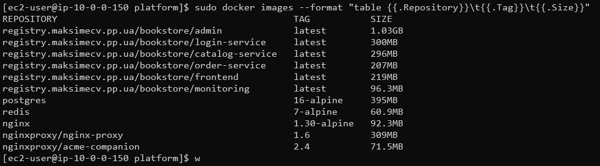 | `docker images` — розміри до multi-stage |
| 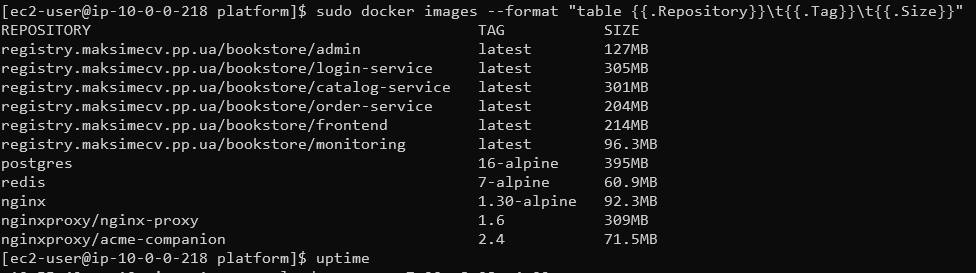 | `docker images` — розміри після multi-stage |
| 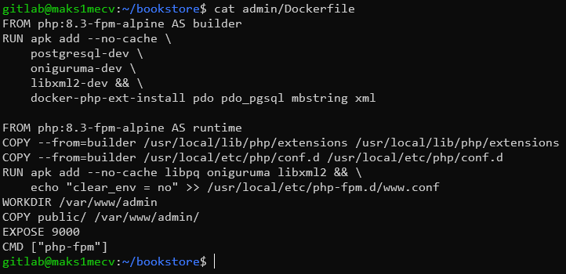 | Вміст multi-stage Dockerfile для `admin` |

---

## Крок 4 — Self-Hosted Registry (Advanced)

**Мета:** Власний Docker Registry на власному домені з HTTPS та розмежуванням прав доступу.

### Архітектура Registry

```
Internet
    │
    ▼
nginx-proxy (443) → registry-auth (nginx:1.30-alpine)
                         │ Basic Auth (htpasswd)
                         ▼
                    registry:2.8
                    (порт 5000, тільки внутрішній)
```

### Розмежування прав

| Файл | Дозволені методи | Користувачі |
|---|---|---|
| `htpasswd_all` | GET, HEAD (pull) | `registryuser`, `reader`, `registryreader` |
| `htpasswd_admin` | POST, PUT, DELETE (push/delete) | `registryuser` |

Read-only доступ для ментора реалізований через окремий запис `registryreader` у `htpasswd_all`. Push-доступ мають лише адміністратори.

### Перевірка доступності registry

```bash
# Авторизація (read-only)
docker login registry.maksimecv.pp.ua \
  -u registryreader -p <password>

# Список репозиторіїв
curl -u "registryreader:<password>" \
  https://registry.maksimecv.pp.ua/v2/_catalog

# Pull образу
docker pull registry.maksimecv.pp.ua/bookstore/monitoring:latest
```

### Підтвердження

| Скріншот | Опис |
|---|---|
| 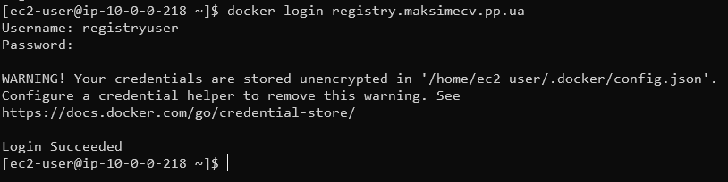 | `docker login registry.maksimecv.pp.ua` — успішна авторизація |
| 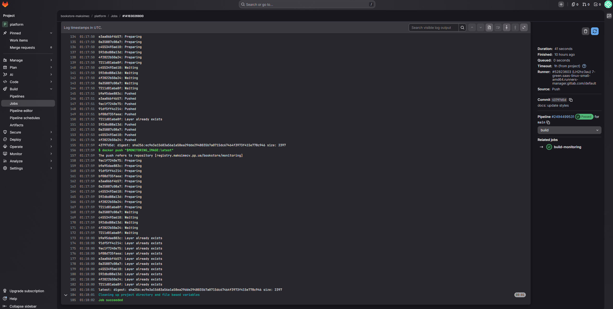 | `docker push` — образ завантажується до self-hosted registry |
| 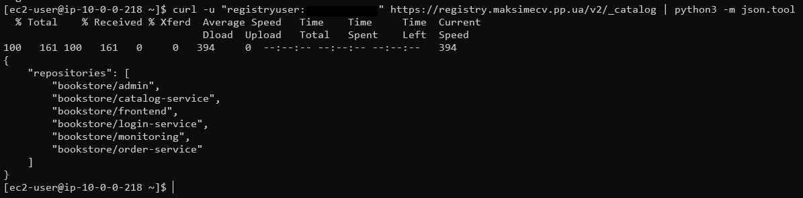 | `curl /v2/_catalog` — список репозиторіїв у registry |
| 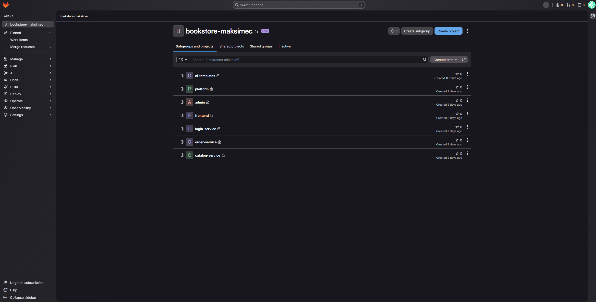 | GitLab group `bookstore-maksimec` з усіма сервісними репозиторіями |

---

## Розгортання для перевірки

### Повний стек

```bash
git clone https://github.com/maksimec/platform-demo.git
cd platform-demo && cp -a .env.example .env

# Конкретні значення REGISTRY_HOST, REGISTRY_USERNAME, REGISTRY_PASSWORD,
# BOOKSTORE_DOMAIN надано в особистих повідомленнях

docker login $REGISTRY_HOST -u $REGISTRY_USERNAME -p $REGISTRY_PASSWORD
docker compose pull
docker compose up -d
docker compose ps
```

### Тільки monitoring-контейнер

```bash
docker login registry.maksimecv.pp.ua -u registryreader -p <password>

docker run -d \
  --name monitoring \
  --restart unless-stopped \
  -v /:/hostfs:ro \
  -v /proc:/host_proc:ro \
  -v monitor_logs:/var/log/monitor \
  registry.maksimecv.pp.ua/bookstore/monitoring:latest

# Перевірка
docker exec monitoring supervisorctl status
docker exec monitoring tail -f /var/log/monitor/disk_monitor.log
```

---

## Definition of Done

- [x] Моніторинговий контейнер з `supervisord` — три процеси без systemd
- [x] Логи у named volume `monitor_logs`, доступні з хоста
- [x] `restart: unless-stopped` у `docker-compose.yml`
- [x] Повноцінний застосунок (5 сервісів + БД) у Docker Compose
- [x] Named volumes для всіх persistent даних (`db_data`, `redis_data`, `monitor_logs`)
- [x] `.env.example` у репозиторії, `.env` у `.gitignore`
- [x] `df -h` після підняття — overlay filesystems зафіксовано
- [x] ⭐ Self-Hosted Registry на `registry.maksimecv.pp.ua` + HTTPS + розмежування прав
- [x] ⭐ Multi-Stage Build — `admin` зменшено з 1.03 GB до 127 MB (−88%)

---

## Файлова структура

```
INT26-24/
├── README.md
├── step1/
│   ├── supervisord_status.png         # supervisorctl status — три процеси RUNNING
│   ├── disk_monitor_log.png           # tail /var/log/monitor/disk_monitor.log
│   ├── ram_monitor_log.png            # tail /var/log/monitor/ram_monitor.log
│   └── docker_ps.png                  # docker compose ps — контейнер Up
├── step2/
│   ├── docker-compose.yml             # Повний docker-compose.yml платформи
│   ├── .env.example                   # Шаблон змінних середовища
│   ├── docker_compose_ps.png          # Всі сервіси healthy
│   ├── docker_volumes.png             # docker volume ls — named volumes
│   ├── df_overlay.png                 # df -h — overlay filesystems
│   ├── browser_storefront.png         # HTTPS сторінка застосунку у браузері
│   └── browser_admin.png             # PHP адмін-панель /admin
├── step3/
│   ├── Dockerfile.admin.before.txt    # Оригінальний Dockerfile (single-stage)
│   ├── Dockerfile.admin.after.txt     # Multi-stage Dockerfile
│   ├── docker_images_before.png       # docker images — до multi-stage
│   ├── docker_images_after.png        # docker images — після multi-stage
│   └── dockerfile_admin_multistage.png# cat Dockerfile — вміст обох стадій
└── step4/
    ├── registry_login.png             # docker login registry.maksimecv.pp.ua
    ├── registry_push.png              # docker push до self-hosted registry
    ├── registry_catalog.png           # curl /v2/_catalog — список образів
    └── gitlab_group_repos.png         # GitLab group bookstore-maksimec
```
