# INT26-30 — GitLab CI/CD Pipeline + Container Registry

---

## Зміст

- [Архітектура CI/CD](#архітектура-cicd)
- [Крок 1 — GitLab CI Pipeline](#крок-1--gitlab-ci-pipeline)
- [Крок 2 — Docker Build + Registry Push](#крок-2--docker-build--registry-push)
- [Крок 3 — Shared CI Templates (Advanced)](#крок-3--shared-ci-templates-advanced)
- [Крок 4 — Quality Gate (Advanced)](#крок-4--quality-gate-advanced)
- [Репозиторії](#репозиторії)
- [Definition of Done](#definition-of-done)
- [Файлова структура](#файлова-структура)

---

## Архітектура CI/CD

```
git push
    │
    ▼
GitLab Pipeline
    │
    ├── include: ci-templates/node-service.yml
    │   ├── lint      (eslint)
    │   ├── security  (npm audit)
    │   ├── test      (jest)
    │   └── health-check (curl /health)
    │
    └── include: ci-templates/docker-build.yml
        └── build     (docker build + docker push)
                             │
                             ▼
                  registry.maksimecv.pp.ua
                  /bookstore/<service>:<sha>
                  /bookstore/<service>:latest
```

Кожен із п'яти сервісів (`frontend`, `order-service`, `catalog-service`, `login-service`, `admin`) має власний `.gitlab-ci.yml`, який включає відповідний шаблон з репозиторію `ci-templates`.

---

## Крок 1 — GitLab CI Pipeline

**Мета:** Автоматична перевірка коду при кожному `git push`. Pipeline падає, якщо будь-який check не проходить.

### Загальна структура stages

```
lint → analysis → security → test → health-check → build
```

| Stage | Що відбувається | Коли виконується |
|---|---|---|
| `lint` | Перевірка стилю коду | Кожен push |
| `analysis` | Статичний аналіз типів | Кожен push |
| `security` | Аудит вразливостей у залежностях | Кожен push |
| `test` | Юніт-тести + coverage | Кожен push |
| `health-check` | Запуск контейнера + `curl /health` | Кожен push |
| `build` | `docker build` + `docker push` | Тільки гілка `main` |

### .gitlab-ci.yml (приклад — frontend)

```yaml
include:
  - project: bookstore-maksimec/ci-templates
    ref: main
    file: node-service.yml
  - project: bookstore-maksimec/ci-templates
    ref: main
    file: docker-build.yml

variables:
  SERVICE_NAME: frontend
  SERVICE_PORT: "3000"
```

### .gitlab-ci.yml (приклад — catalog-service)

```yaml
include:
  - project: bookstore-maksimec/ci-templates
    ref: main
    file: python-service.yml
  - project: bookstore-maksimec/ci-templates
    ref: main
    file: docker-build.yml

variables:
  SERVICE_NAME: catalog-service
  SERVICE_PORT: "5001"
```

### Підтвердження

| Скріншот | Опис |
|---|---|
| 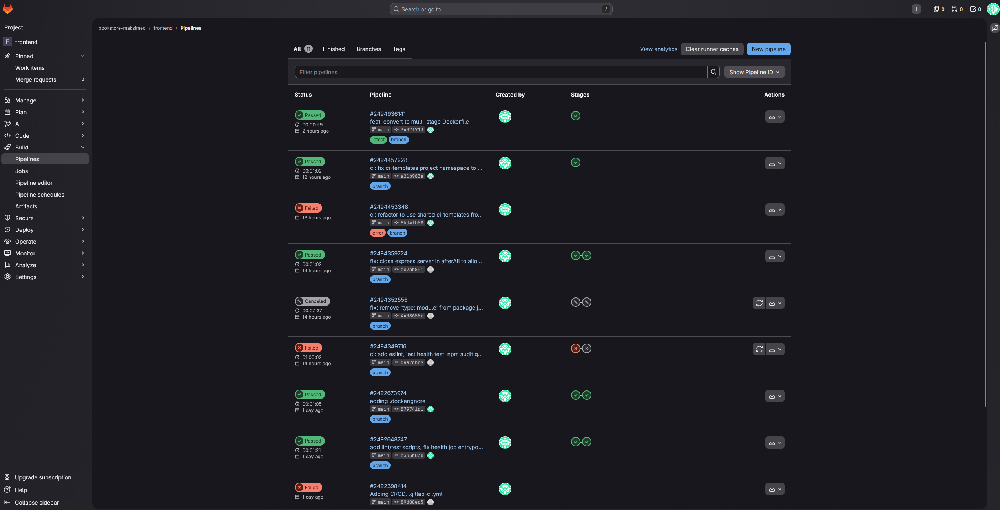 | GitLab — список успішних pipelines після push |
| 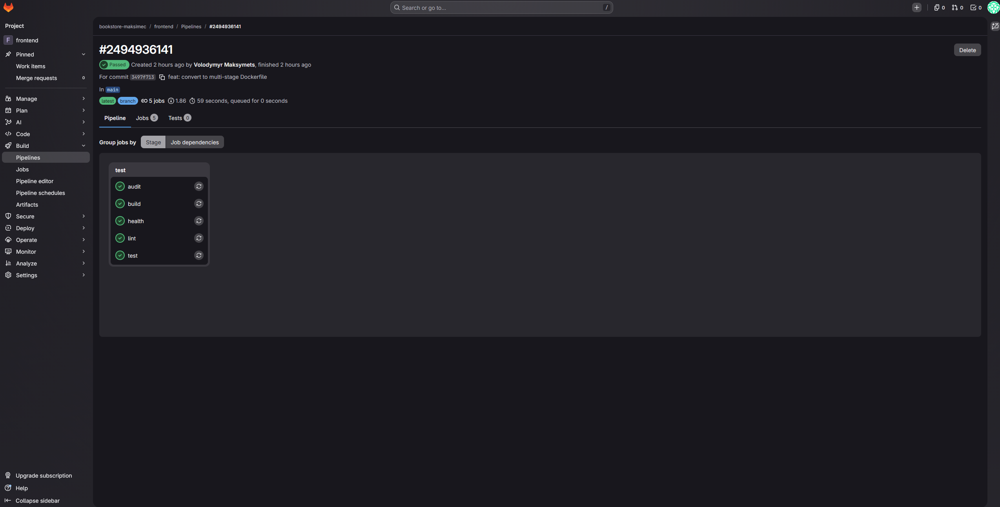 | Всі stages зелені для `frontend` |
|  | Всі stages зелені для `catalog-service` |
| 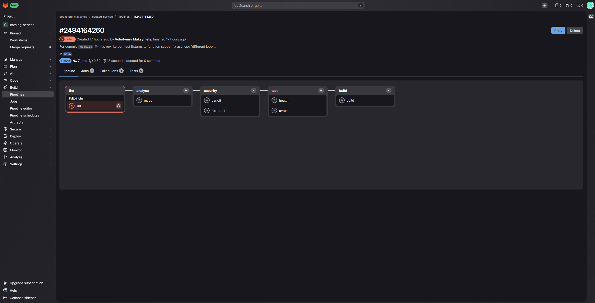 | Pipeline падає при lint-помилці (демонстрація) |

---

## Крок 2 — Docker Build + Registry Push

**Мета:** Docker image збирається автоматично через CI — не вручну на сервері. Image тегується по git SHA і `latest`, публікується у self-hosted registry.

### Конвенція тегування

```
registry.maksimecv.pp.ua/bookstore/<service>:<git-sha>
registry.maksimecv.pp.ua/bookstore/<service>:latest   # тільки main
```

### docker-build.yml (спрощено)

```yaml
build:
  stage: build
  image: docker:27
  services:
    - docker:27-dind
  rules:
    - if: $CI_COMMIT_BRANCH == "main"
  script:
    - docker login $REGISTRY_HOST -u $REGISTRY_USERNAME -p $REGISTRY_PASSWORD
    - docker build -t $REGISTRY_HOST/bookstore/$SERVICE_NAME:$CI_COMMIT_SHORT_SHA .
    - docker build -t $REGISTRY_HOST/bookstore/$SERVICE_NAME:latest .
    - docker push $REGISTRY_HOST/bookstore/$SERVICE_NAME:$CI_COMMIT_SHORT_SHA
    - docker push $REGISTRY_HOST/bookstore/$SERVICE_NAME:latest
```

### CI/CD Variables у GitLab

Секретні значення зберігаються у `GitLab → Settings → CI/CD → Variables`, не в коді:

| Змінна | Scope | Опис |
|---|---|---|
| `REGISTRY_HOST` | Group | Хост registry |
| `REGISTRY_USERNAME` | Group | Логін для push |
| `REGISTRY_PASSWORD` | Group, Masked | Пароль для push |

### Підтвердження

| Скріншот | Опис |
|---|---|
| 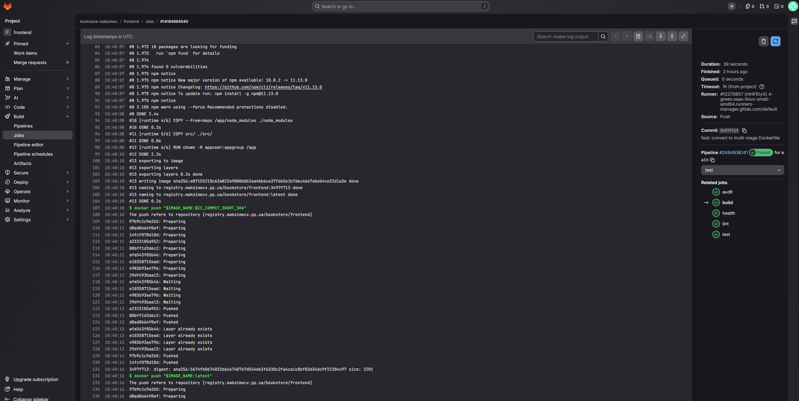 | Лог `build` job — `docker build` + `docker push` |
| 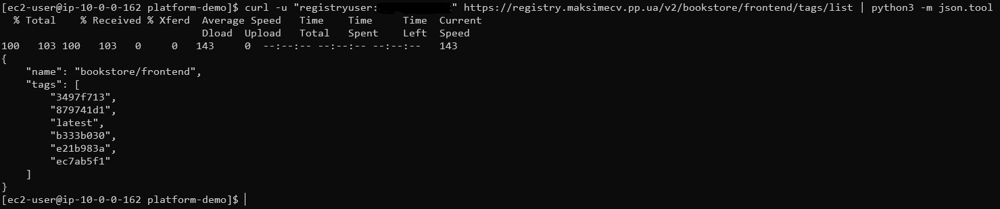 | `curl /v2/bookstore/frontend/tags/list` — теги після CI |
| 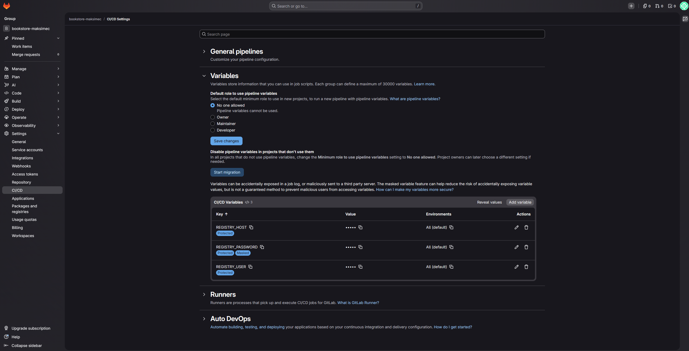 | CI/CD Variables у GitLab Group settings |

---

## Крок 3 — Shared CI Templates (Advanced)

**Мета:** Винести спільні CI-кроки в окремий репозиторій щоб уникнути дублювання між 5 сервісами. Аналог GitHub Reusable Workflows у GitLab.

### Репозиторій `ci-templates`

```
ci-templates/
├── node-service.yml    # eslint + npm audit + jest + health-check
├── python-service.yml  # ruff + mypy + pip-audit + pytest + health-check
├── php-service.yml     # phpcs + phpstan + psalm + composer audit + health-check
└── docker-build.yml    # docker build + push (universal)
```

### Принцип роботи

Сервіс не дублює логіку — лише оголошує змінні і підключає потрібний шаблон:

```yaml
# Весь .gitlab-ci.yml сервісу:
include:
  - project: bookstore-maksimec/ci-templates
    ref: main
    file: python-service.yml
  - project: bookstore-maksimec/ci-templates
    ref: main
    file: docker-build.yml

variables:
  SERVICE_NAME: login-service
  SERVICE_PORT: "5003"
```

### Порівняння: без шаблонів vs з шаблонами

| Метрика | Без шаблонів | З шаблонами |
|---|---|---|
| Рядків конфігу на сервіс | ~80-120 рядків | ~10 рядків |
| Дублювання логіки | ×5 (у кожному сервісі) | ×1 (у ci-templates) |
| Оновлення pipeline | 5 файлів | 1 файл |

### Доступ ci-templates для runner

Репозиторій `ci-templates` виставлено у `Internal` visibility — CI runner у межах GitLab group автоматично отримує доступ через `CI_JOB_TOKEN` без необхідності додавати deploy keys.

### Підтвердження

| Скріншот | Опис |
|---|---|
| 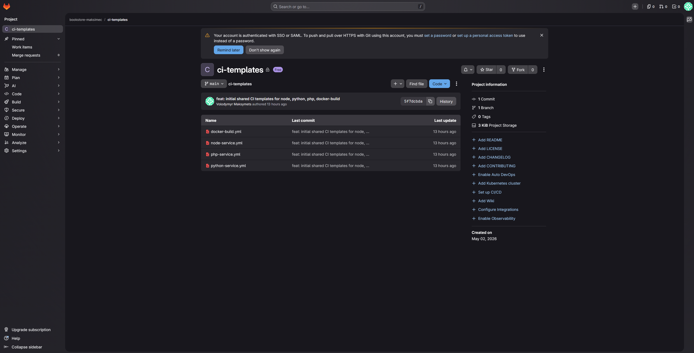 | Репозиторій `bookstore-maksimec/ci-templates` |
| 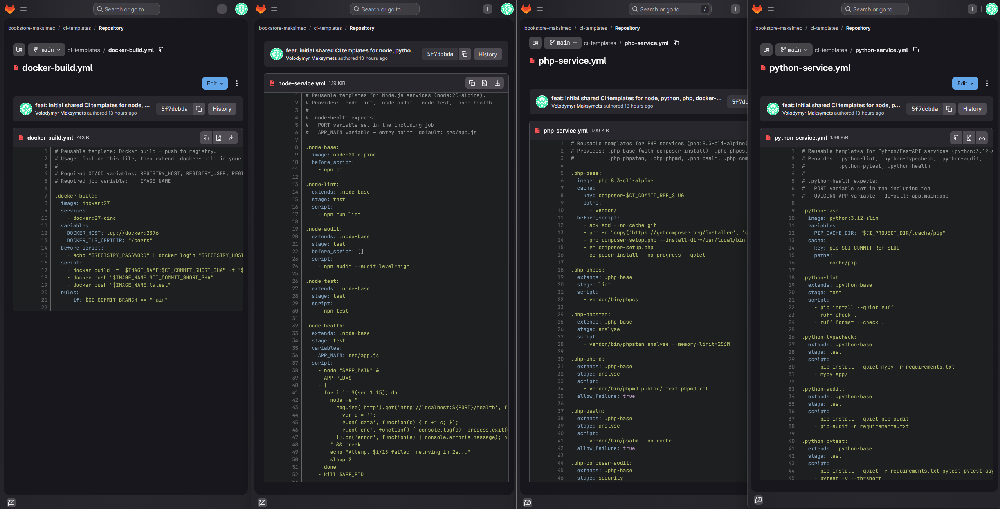 | Вміст: 4 yaml-шаблони |
| 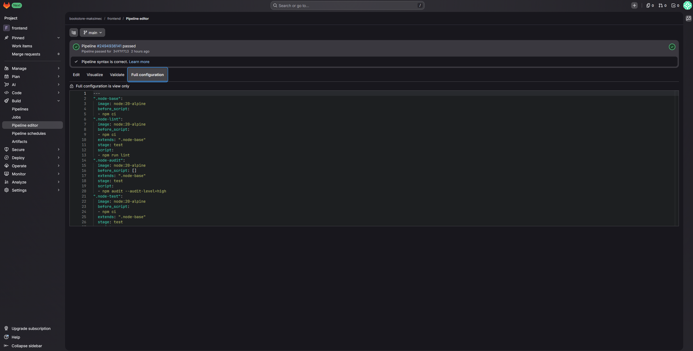 | GitLab CI Editor — `include` успішно резолвиться |
| 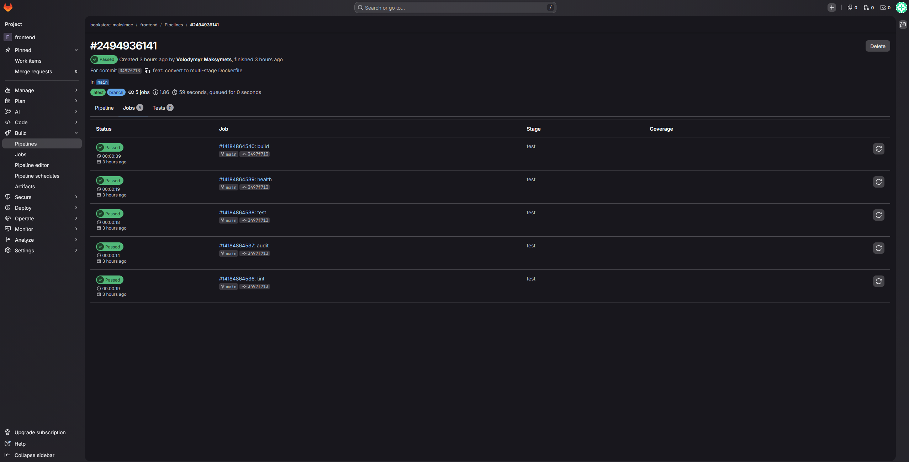 | Pipeline: jobs успадковані з ci-templates |

---

## Крок 4 — Quality Gate (Advanced)

**Мета:** Pipeline повністю падає при невдалій перевірці. Кожен сервіс проходить перевірки відповідно до свого стеку.

### Покриття per service

| Check | `frontend` | `order-service` | `catalog-service` | `login-service` | `admin` |
|---|---|---|---|---|---|
| Linting | `eslint` | `eslint` | `ruff` | `ruff` | `phpcs` |
| Type analysis | — | — | `mypy` | `mypy` | `phpstan` + `psalm` |
| Security audit | `npm audit` | `npm audit` | `pip-audit` | `pip-audit` | `composer audit` |
| Unit tests | `jest` | `jest` | `pytest` | `pytest` | — |
| `/health` check | ✅ | ✅ | ✅ | ✅ | ✅ |

### Health-check механізм

Для кожного сервісу CI запускає контейнер у фоні, робить `sleep 5`, потім перевіряє endpoint:

```bash
# node-service.yml (health-check job)
docker run -d --name svc_test \
  -e DATABASE_URL=$TEST_DATABASE_URL \
  $REGISTRY_HOST/bookstore/$SERVICE_NAME:$CI_COMMIT_SHORT_SHA
sleep 5
curl --fail http://localhost:$SERVICE_PORT/health
docker stop svc_test && docker rm svc_test
```

### Підтвердження

| Скріншот | Опис |
|---|---|
| 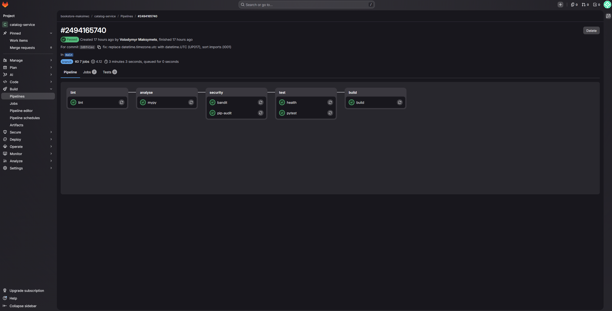 | Всі 6 stages зелені — повний Quality Gate пройдено |
|  | Pipeline падає на `lint` stage (навмисна помилка) |
| 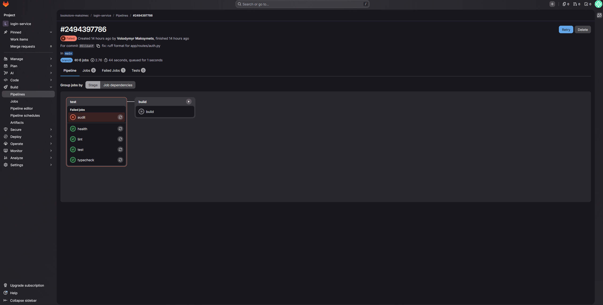 | Pipeline падає на `security` stage (вразлива залежність) |
| 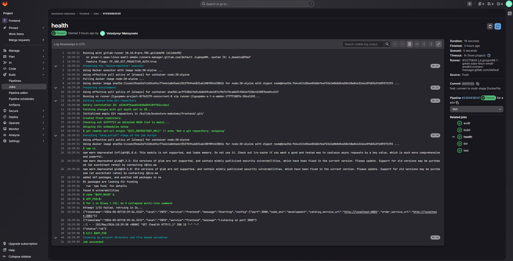 | Лог `health-check` job — `curl /health` повертає 200 OK |

---

## Репозиторії

| Репозиторій | URL | Опис |
|---|---|---|
| `platform-demo` | https://github.com/maksimec/platform-demo | Публічний — docker-compose + .env.example для розгортання |
| GitLab Group | `gitlab.com/bookstore-maksimec` | Закрита group з усіма сервісами (скріншот нижче) |
| `ci-templates` | `gitlab.com/bookstore-maksimec/ci-templates` | Shared CI/CD шаблони |

### Розгортання для перевірки

```bash
git clone https://github.com/maksimec/platform-demo.git
cd platform-demo && cp -a .env.example .env

# Конкретні значення надано в особистих повідомленнях
docker login $REGISTRY_HOST -u $REGISTRY_USERNAME -p $REGISTRY_PASSWORD
docker compose pull
docker compose up -d
docker compose ps
```

---

## Definition of Done

- [x] GitLab CI/CD pipeline для кожного сервісу (`.gitlab-ci.yml`)
- [x] Автоматична збірка Docker image при push у `main`
- [x] Автоматичний push у Container Registry (SHA + `latest`)
- [x] `Dockerfile`, `docker-compose.yml`, `.gitlab-ci.yml`, `README.md` у репозиторіях
- [x] Pipeline падає при невдалій перевірці
- [x] ⭐ Shared CI Templates — `ci-templates/` репозиторій з 4 шаблонами
- [x] ⭐ Quality Gate — lint + type analysis + security + test + `/health` check

---

## Файлова структура

```
INT26-30/
├── README.md
├── step1/
│   ├── pipeline_list.png              # GitLab — список успішних pipelines
│   ├── pipeline_stages.png            # Всі stages зелені (Node.js сервіс)
│   ├── pipeline_stages_python.png     # Всі stages зелені (Python сервіс)
│   └── pipeline_fail_lint.png         # Pipeline падає при lint-помилці
├── step2/
│   ├── build_job_log.png              # Лог build job: docker build + push
│   ├── registry_images.png            # Теги образів у registry після CI
│   └── gitlab_ci_variables.png        # CI/CD Variables у GitLab Group
├── step3/
│   ├── ci_templates_repo.png          # Репозиторій bookstore-maksimec/ci-templates
│   ├── ci_templates_files.png         # Вміст: 4 yaml-шаблони
│   ├── pipeline_include_resolved.png  # CI Editor — include резолвиться
│   └── pipeline_inherited_jobs.png    # Pipeline з успадкованими jobs
└── step4/
    ├── quality_gate_pass.png          # Всі stages зелені — Gate пройдено
    ├── quality_gate_fail_lint.png     # Падіння на lint stage
    ├── quality_gate_fail_security.png # Падіння на security stage
    └── health_check_log.png           # curl /health → 200 OK
```
