# INT26-37 — Ansible Configuration Management

---

## Зміст

- [Архітектура деплою](#архітектура-деплою)
- [Крок 1 — Docker на обох інстансах](#крок-1--docker-на-обох-інстансах)
- [Крок 2 — PostgreSQL на db-інстансі](#крок-2--postgresql-на-db-інстансі)
- [Крок 3 — Bookstore Application Stack](#крок-3--bookstore-application-stack)
- [Крок 4 — Monitoring, Nginx та DNS](#крок-4--monitoring-nginx-та-dns)
- [Бонуси](#бонуси)
- [Репозиторії](#репозиторії)
- [Definition of Done](#definition-of-done)
- [Файлова структура](#файлова-структура)

---

## Архітектура деплою

```
ansible-playbook site.yml
        │
        ├── bookstore_web + bookstore_db
        │   └── role: docker          → Docker Engine + Compose Plugin
        │
        ├── bookstore_db
        │   └── role: postgres        → PostgreSQL 16 у Docker Compose
        │                               init.sql застосовано (books, orders, admin_users)
        │
        ├── bookstore_web
        │   ├── role: ssh_setup       → Deploy key з S3, SSH config для GitLab
        │   ├── role: bookstore       → git clone + .env + docker-compose.override.yml
        │   │                           postgres stub + DATABASE_URL → db-хост
        │   ├── role: monitoring      → bookstore-monitoring:local (supervisord)
        │   ├── role: nginx           → nginx-proxy + acme-companion + bookstore-nginx
        │   └── role: dns             → Route 53 A-record для домену
        │
        └── Dynamic Inventory (aws_ec2)
            bookstore_web → public_ip_address
            bookstore_db  → public_ip_address
```

### Топологія мережі

```
Internet
    │
    ▼
bookstore_web (EC2)
  ├── nginx-proxy          :80 / :443
  ├── bookstore-nginx      :80  (internal)
  ├── frontend             :3000
  ├── catalog-service      :5001  ──┐
  ├── order-service        :5002  ──┤──► bookstore_db (EC2) :5432
  ├── login-service        :5003  ──┘
  ├── admin-fpm            :9000
  └── monitoring           (supervisor: disk + ram + log_watcher)

bookstore_db (EC2)
  └── bookstore-postgres   :5432  (SG: відкритий лише для web-інстансу)
```

---

## Крок 1 — Docker на обох інстансах

**Мета:** Встановити Docker Engine та Compose Plugin на обидва EC2-інстанси через роль `docker`. Включає swap (1 GB) для стабільної роботи на t3.micro.

### Що виконує роль `docker`

| Задача | Результат |
|---|---|
| Додає GPG-ключ та apt-репозиторій Docker | Офіційний репозиторій docker.com |
| Встановлює `docker-ce`, `docker-ce-cli`, `containerd.io`, `buildx`, `compose` plugin | Docker Engine з Compose v2 |
| `systemctl enable --now docker` | Docker стартує автоматично |
| Додає `ubuntu` до групи `docker` | Команди без `sudo` |
| Створює swapfile 1 GB, `swappiness=10` | Запобігає OOM на t3.micro |

### Підтвердження

| Скріншот | Опис |
|---|---|
| 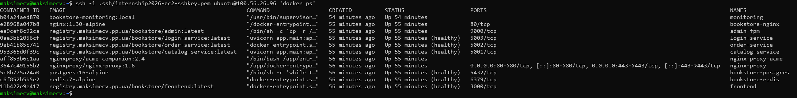 | `docker ps` на web-інстансі |
| 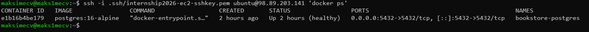 | `docker ps` на db-інстансі |
| 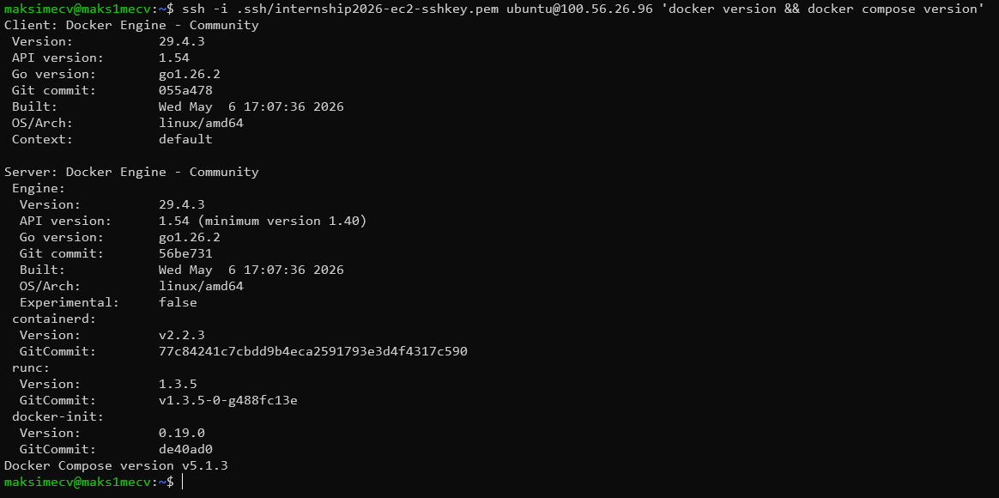 | `docker version` + `docker compose version` на web |
| 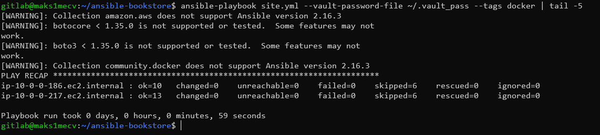 | `PLAY RECAP` після `--tags docker` — 0 failed |

---

## Крок 2 — PostgreSQL на db-інстансі

**Мета:** Розгорнути PostgreSQL 16 у Docker Compose на окремому EC2-інстансі. Застосувати `init.sql` (таблиці, індекси, seed-дані). Порт 5432 відкритий лише для web-інстансу.

### docker-compose.yml (шаблон ролі `postgres`)

```yaml
services:
  postgres:
    image: postgres:16-alpine
    container_name: bookstore-postgres
    restart: unless-stopped
    env_file: .env
    ports:
      - "5432:5432"
    volumes:
      - db_data:/var/lib/postgresql/data
    healthcheck:
      test: ["CMD-SHELL", "pg_isready -U ${POSTGRES_USER} -d ${POSTGRES_DB}"]
      interval: 10s
      timeout: 5s
      retries: 5
```

### Що виконує роль `postgres`

| Задача | Результат |
|---|---|
| Деплой `docker-compose.yml.j2` та `.env.j2` | Credentials через Ansible Vault |
| `docker_compose_v2: state: present` | Контейнер запущено |
| `docker_container_info` until `healthy` | Очікування готовності |
| `docker cp init.sql` + `docker exec psql -f` | Таблиці, індекси, seed-дані (idempotent) |

### Security Group

Inbound rule на db-інстансі: TCP 5432 — source `<SG web-інстансу>`. Жодного правила `0.0.0.0/0` для порту 5432.

### Підтвердження

| Скріншот | Опис |
|---|---|
|  | `docker ps` на db — `bookstore-postgres (healthy)` |
| 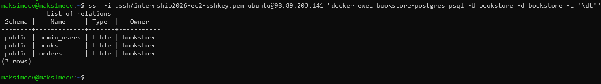 | `\dt` у psql — таблиці `books`, `orders`, `admin_users` |
| 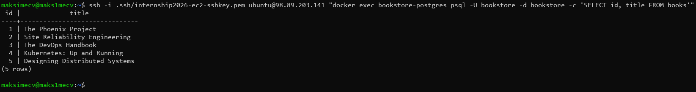 | `SELECT id, title FROM books` — seed-дані присутні |
| 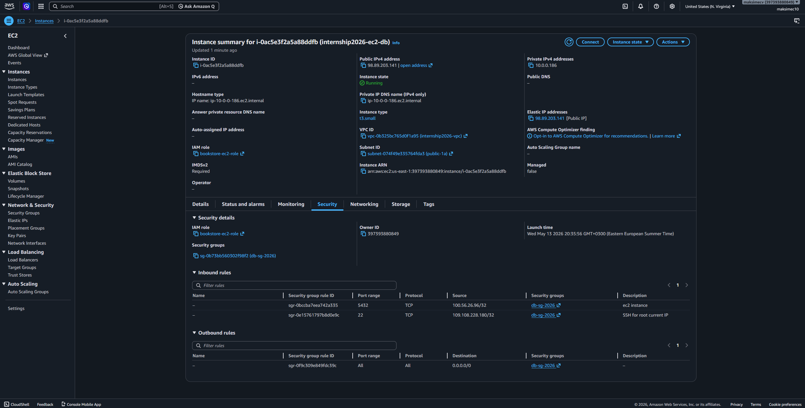 | AWS Console — SG db-інстансу, inbound TCP 5432 |
| 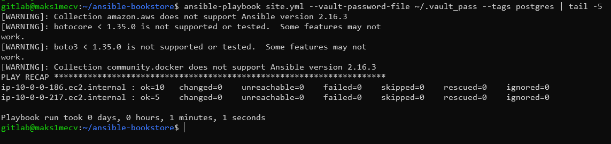 | `PLAY RECAP` після `--tags postgres` — 0 failed |

---

## Крок 3 — Bookstore Application Stack

**Мета:** Задеплоїти повний мікросервісний стек на web-інстансі. PostgreSQL знаходиться на окремому db-хості — `docker-compose.override.yml` замінює stub-контейнер і перенаправляє `DATABASE_URL` на зовнішній db-хост.

### Схема override-патерну

```
docker-compose.yml          (оригінальний — postgres: image локальний)
        +
docker-compose.override.yml (Ansible-генерований)
  ├── postgres:              → stub (sleep loop + exit 0 healthcheck)
  ├── catalog-service:       → DATABASE_URL: postgresql+asyncpg://...@<db_host>:5432/...
  ├── order-service:         → DATABASE_URL: postgresql://...@<db_host>:5432/...
  ├── login-service:         → DATABASE_URL: postgresql+asyncpg://...@<db_host>:5432/...
  └── monitoring:            → profiles: [disabled]
```

Сервіси бачать `depends_on: postgres: condition: service_healthy` — stub відповідає `healthy` миттєво. Реальні запити до БД ідуть на зовнішній db-хост.

### Змінні з Ansible Vault

| Змінна vault | Призначення |
|---|---|
| `vault_postgres_password` | Пароль БД |
| `vault_jwt_secret` | JWT signing key |
| `vault_session_secret` | Session encryption key |
| `vault_registry_password` | GitLab Container Registry |

Жодне з цих значень не потрапляє у репозиторій — зберігаються у зашифрованому `group_vars/all/vault.yml`.

### Підтвердження

| Скріншот | Опис |
|---|---|
|  | `docker ps` — всі сервіси `(healthy)` |
| 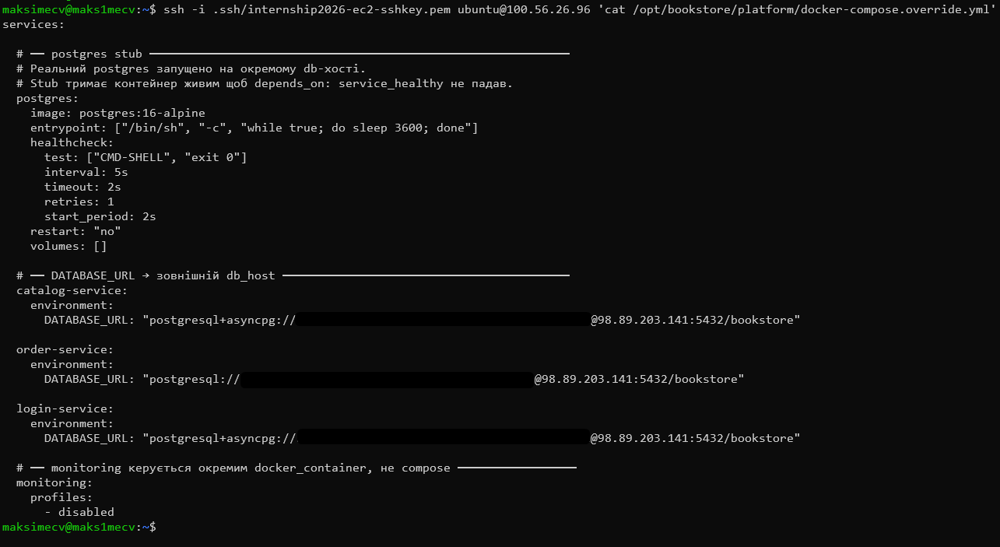 | `cat docker-compose.override.yml` на web-інстансі |
| 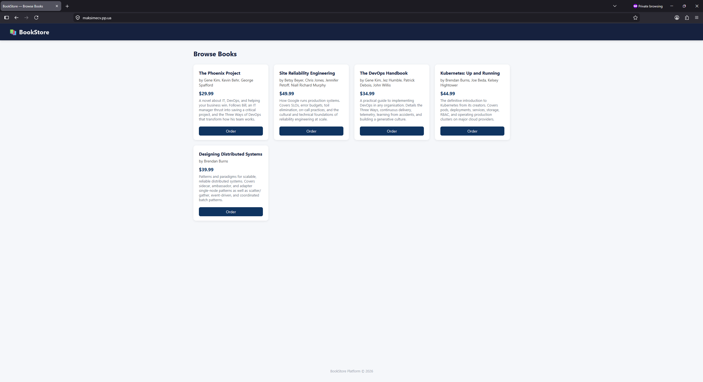 | Браузер — головна сторінка bookstore |
| 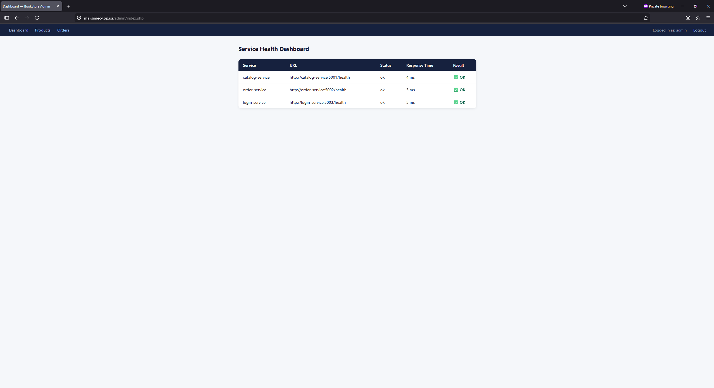 | Браузер — `/admin` панель |
| 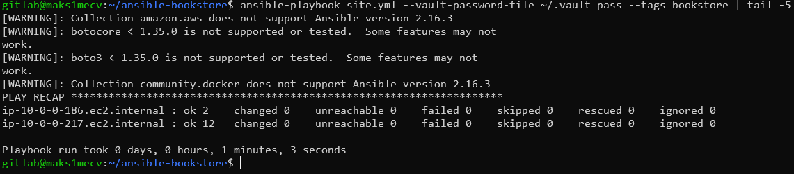 | `PLAY RECAP` після `--tags bookstore` — 0 failed |

---

## Крок 4 — Monitoring, Nginx та DNS

**Мета:** Запустити monitoring-контейнер (disk + RAM + log watcher через supervisord), налаштувати Nginx reverse proxy з автоматичним TLS через Let's Encrypt, створити DNS A-record у Route 53.

### Роль `monitoring`

Контейнер збирається локально з `bookstore/monitoring/Dockerfile` (Alpine + supervisord). Три процеси під supervisord:

| Процес | Функція |
|---|---|
| `disk_monitor_worker` | Кожні 60 с перевіряє `/hostfs` — WARNING якщо > 80% |
| `ram_monitor_worker` | Кожні 60 с читає `/host_proc/meminfo` — WARNING якщо > 85% |
| `log_watcher` | `tail -F` disk + ram логів, записує WARNING-рядки у `email_notifications.log` |

Rebuild відбувається лише якщо змінився `Dockerfile` (checksum-порівняння).

### Роль `nginx`

Запускає три контейнери через `docker_compose_v2`:

| Контейнер | Роль |
|---|---|
| `nginx-proxy` | Автоматична генерація nginx-конфігів через `VIRTUAL_HOST` |
| `acme-companion` | Автоматичний випуск і оновлення Let's Encrypt сертифікатів |
| `bookstore-nginx` | Routing: `/api/catalog/`, `/api/orders/`, `/api/auth/`, `/admin`, `/` |

### Роль `dns`

Модуль `amazon.aws.route53` створює або оновлює A-record:

```
{{ bookstore_domain }}  300  IN  A  {{ ansible_host }}
```

Виконується на `localhost` (`delegate_to: localhost`) — звернення до Route 53 API відбувається з control node, не з EC2.

### Підтвердження

| Скріншот | Опис |
|---|---|
| 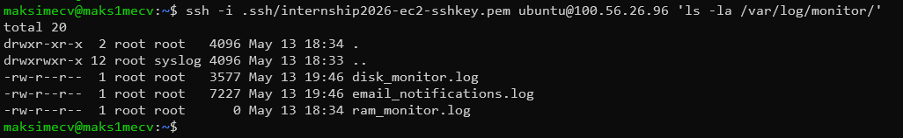 | `ls /var/log/monitor/` — лог-файли присутні |
| 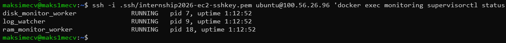 | `docker exec monitoring supervisorctl status` — всі RUNNING |
| 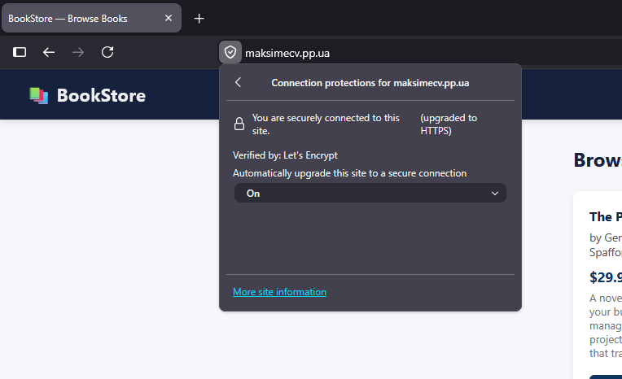 | Браузер — `https://{{ domain }}` з валідним TLS сертифікатом |
| 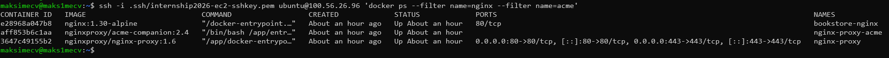 | `docker ps` — `nginx-proxy`, `acme-companion`, `bookstore-nginx` |
| 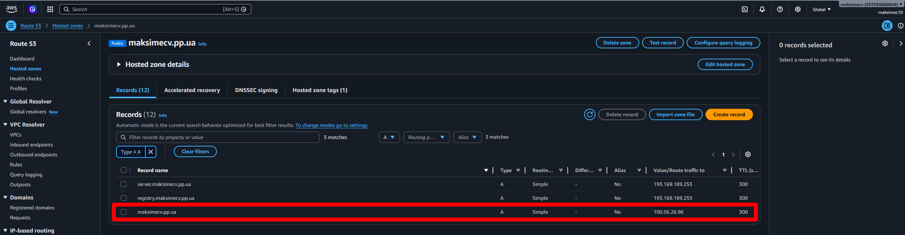 | AWS Console — Route 53, A-record для домену |
|  | Повний `PLAY RECAP` — обидва хости, 0 failed |

---

## Бонуси

### ⭐ Dynamic Inventory через `aws_ec2` plugin

Інстанси виявляються автоматично за тегами `Project=bookstore` та `Role=web/db`. Статичний inventory відсутній.

```yaml
# inventory/aws_ec2.yml (фрагмент)
keyed_groups:
  - key: tags.Role
    prefix: bookstore
    separator: "_"
compose:
  ansible_host: public_ip_address
```

| Скріншот | Опис |
|---|---|
| 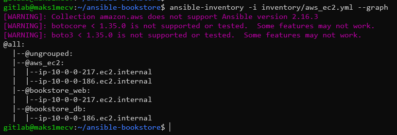 | `ansible-inventory --graph` — `bookstore_web`, `bookstore_db` |
| 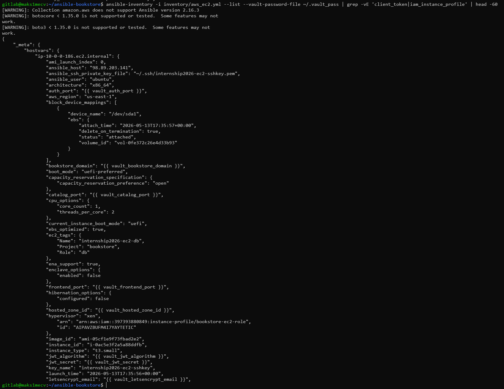 | `ansible-inventory --list` — змінні хостів (ansible_host, ansible_user) |

### ⭐ HTTPS через Let's Encrypt (acme-companion)

TLS сертифікат автоматично випускається і оновлюється. Конфігурація декларативна — через `VIRTUAL_HOST` та `LETSENCRYPT_HOST` environment variables на `bookstore-nginx`.

### ⭐ Idempotency — повторний запуск дає 0 changed

| Скріншот | Опис |
|---|---|
| 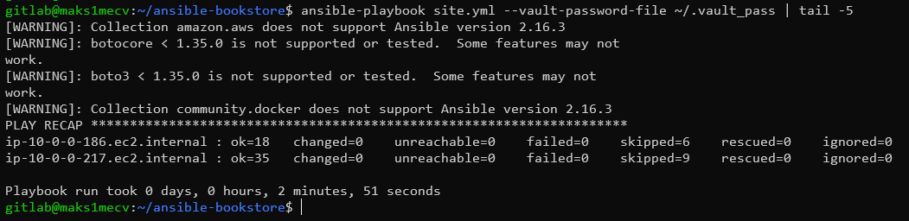 | Другий запуск `site.yml` — `changed=0` на обох хостах |

---

## Репозиторії

| Репозиторій | URL | Опис |
|---|---|---|
| `ansible` | `gitlab.com/bookstore-maksimec/ansible` | Закритий — Ansible playbook (доступ за запитом) |
| `platform` | `github.com/maksimec/platform-demo` | Відкритий — docker-compose стек сервісів (створювався в ході виконання INT26-24) |

### Перевірка inventory

```bash
ansible-inventory -i inventory/aws_ec2.yml --graph
ansible-inventory -i inventory/aws_ec2.yml --list
```

### Запуск деплою

```bash
ansible-playbook site.yml --vault-password-file ~/.vault_pass
```

---

## Definition of Done

- [x] Два EC2 (Ubuntu 22.04): `bookstore_web` + `bookstore_db`
- [x] Роль `docker` — Docker Engine + Compose Plugin на обидва інстанси
- [x] Роль `postgres` — PostgreSQL 16 у Docker, init.sql застосовано
- [x] Роль `bookstore` — повний мікросервісний стек, БД на окремому хості
- [x] Роль `monitoring` — контейнер із disk/RAM/log моніторингом
- [x] Роль `nginx` — reverse proxy + автоматичний TLS
- [x] Роль `dns` — A-record у Route 53
- [x] Jinja2-шаблони: `.env.j2`, `docker-compose.yml.j2`, `docker-compose.override.yml.j2`
- [x] Tags: `--tags docker/postgres/ssh_setup/bookstore/monitoring/nginx/dns`
- [x] Handlers: `restart bookstore compose`, `restart postgres compose`
- [x] Credentials — Ansible Vault, у `.gitignore`
- [x] SG db-інстансу: TCP 5432 лише для web-інстансу
- [x] ⭐ Dynamic inventory через `aws_ec2` plugin
- [x] ⭐ HTTPS через Let's Encrypt (acme-companion)
- [x] ⭐ Idempotency — повторний запуск `changed=0`

---

## Файлова структура

```
INT26-37/
├── README.md
├── step1/
│   ├── docker_ps_web.png              # docker ps на web-інстансі
│   ├── docker_ps_db.png               # docker ps на db-інстансі
│   ├── docker_version_web.png         # docker version + docker compose version
│   └── play_recap_docker.png          # PLAY RECAP --tags docker
├── step2/
│   ├── postgres_healthy.png           # docker ps — bookstore-postgres (healthy)
│   ├── psql_tables.png                # \dt у psql — таблиці присутні
│   ├── psql_seed.png                  # SELECT id, title FROM books — seed-дані
│   ├── sg_inbound_rule.png            # AWS SG — inbound TCP 5432
│   └── play_recap_postgres.png        # PLAY RECAP --tags postgres
├── step3/
│   ├── docker_ps_stack.png            # docker ps — всі сервіси healthy
│   ├── override_file.png              # cat docker-compose.override.yml
│   ├── bookstore_ui.png               # Браузер — головна сторінка
│   ├── bookstore_admin.png            # Браузер — /admin панель
│   └── play_recap_bookstore.png       # PLAY RECAP --tags bookstore
├── step4/
│   ├── monitoring_logs.png            # ls /var/log/monitor/
│   ├── supervisord_status.png         # supervisorctl status — всі RUNNING
│   ├── https_browser.png              # https:// з валідним сертифікатом
│   ├── nginx_containers.png           # docker ps — nginx-proxy, acme, bookstore-nginx
│   ├── route53_record.png             # AWS Route 53 — A-record
│   └── play_recap_full.png            # Повний PLAY RECAP — 0 failed
└── bonus/
    ├── inventory_graph.png            # ansible-inventory --graph
    ├── inventory_list.png             # ansible-inventory --list
    └── idempotency_recap.png          # Повторний запуск — changed=0
```

