# INT26-39 — Terraform: повний цикл IaC

---

## Зміст

- [Архітектура проєкту](#архітектура-проєкту)
- [Крок 0 — Підготовка](#крок-0--підготовка)
- [Крок 1 — Remote State: S3](#крок-1--remote-state-s3)
- [Крок 2 — VPC](#крок-2--vpc)
- [Крок 3 — EC2 з SSH ключем](#крок-3--ec2-з-ssh-ключем)
- [Крок 4 — Ansible provisioning через Terraform](#крок-4--ansible-provisioning-через-terraform)
- [Крок 5 — State Management: import та rename](#крок-5--state-management-import-та-rename)
- [Бонуси](#бонуси)
- [Definition of Done](#definition-of-done)
- [Файлова структура](#файлова-структура)

---

## Архітектура проєкту

```
terraform apply
        │
        ├── Remote State
        │   └── S3 bucket: tf-state-maksimecv-8828
        │       └── dev/terraform.tfstate
        │
        ├── Networking (vpc.tf)
        │   ├── aws_vpc            10.0.0.0/16
        │   ├── aws_subnet         10.0.1.0/24  (public)
        │   ├── aws_internet_gateway
        │   ├── aws_route_table    0.0.0.0/0 → IGW
        │   └── aws_route_table_association
        │
        ├── Compute (ec2.tf, keys.tf, sg.tf, iam.tf)
        │   ├── tls_private_key    RSA 4096 → keys/bookstore.pem
        │   ├── aws_key_pair       bookstore-key
        │   ├── aws_security_group web  (22, 80, 443)
        │   ├── aws_security_group db   (22, 5432 ← web SG)
        │   ├── aws_iam_role       bookstore-web-ec2-role  (S3 GetObject)
        │   ├── aws_instance       bookstore-web  (t3.small, ubuntu)
        │   └── aws_instance       bookstore-db   (t3.small, ubuntu)
        │
        ├── DNS (dns.tf)
        │   └── cloudflare_record  A → aws_instance.web.public_ip
        │
        ├── Provisioning (ansible.tf)
        │   ├── null_resource wait_for_ssh_web  (SSH polling loop)
        │   ├── null_resource wait_for_ssh_db   (SSH polling loop)
        │   └── null_resource ansible_provisioning
        │       └── local-exec: ansible-playbook site.yml
        │           -e db_host=<db private_ip>
        │           -e bookstore_domain=<var.bookstore_domain>
        │
        └── State Management (lifecycle.tf, secrets.tf)
            ├── aws_s3_bucket tf_state_protected  (prevent_destroy = true)
            └── aws_secretsmanager_secret app_secret
```

### Топологія мережі

```
Internet
    │
    ▼
bookstore-web (EC2, public subnet)
  ├── Security Group: TCP 22, 80, 443 ← 0.0.0.0/0
  ├── IAM Instance Profile → S3 GetObject (deploy keys)
  ├── nginx-proxy          :80 / :443   (Let\'s Encrypt TLS)
  ├── bookstore-nginx      :80  (internal)
  ├── frontend             :3000
  ├── catalog-service      :5001  ──┐
  ├── order-service        :5002  ──┤──► bookstore-db :5432
  ├── login-service        :5003  ──┘
  ├── admin-fpm            :9000
  └── monitoring           (supervisord: disk + ram + log_watcher)

bookstore-db (EC2, public subnet)
  ├── Security Group: TCP 22 ← 0.0.0.0/0
  │                  TCP 5432 ← bookstore-web SG
  └── bookstore-postgres :5432
```

---

## Крок 0 — Підготовка

Два окремих каталоги Terraform:

| Каталог | Призначення |
|---|---|
| `remote-state/` | Створює S3 bucket для зберігання state проєкту (local backend) |
| `project/` | Основний проєкт з усією інфраструктурою (S3 backend) |

---

## Крок 1 — Remote State: S3

**Мета:** Перенести Terraform state до S3, щоб він зберігався централізовано, а не локально.

### Послідовність дій

1. У `remote-state/` створити `aws_s3_bucket` із `local` backend та виконати `terraform init && terraform apply`.
2. У `project/backend.tf` прописати `backend "s3"` з ARN створеного bucket.
3. Виконати `terraform init` — Terraform запропонує мігрувати local state до S3.

### backend.tf (фрагмент)

```hcl
backend "s3" {
  bucket = "tf-state-maksimecv-8828"
  key    = "dev/terraform.tfstate"
  region = "us-east-1"
}
```

### Захист state bucket

```hcl
resource "aws_s3_bucket" "tf_state_protected" {
  bucket        = "tf-state-maksimecv-8828"
  force_destroy = false

  lifecycle {
    prevent_destroy = true
  }
}
```

### Підтвердження

| Скріншот | Опис |
|---|---|
| 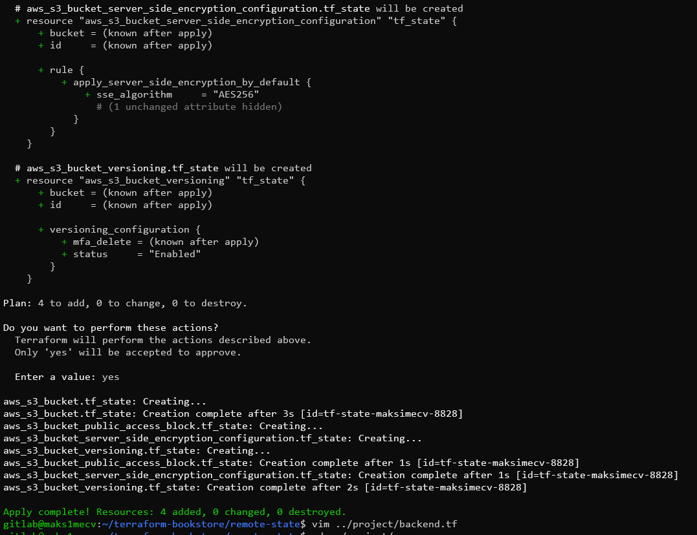 | `terraform apply` у remote-state/ |
| 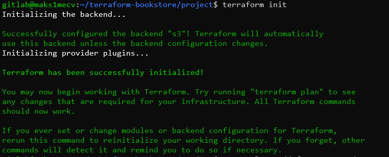 | `terraform init` у project/ — міграція state до S3 |
| 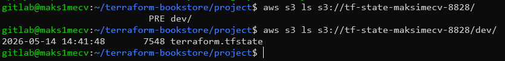 | `aws s3 ls` — `dev/terraform.tfstate` у bucket |
| 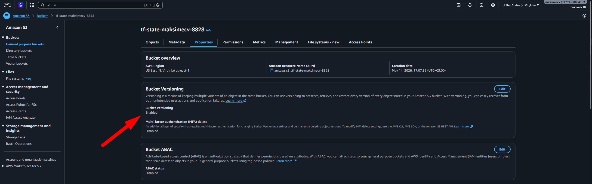 | AWS Console — S3 bucket, versioning enabled |
| 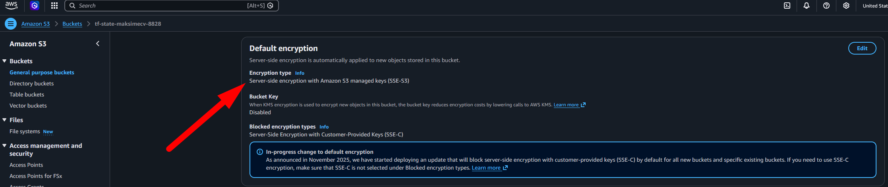 | AWS Console — S3 bucket, server-side encryption |

---

## Крок 2 — VPC

**Мета:** Підняти мінімальну мережеву інфраструктуру вручну (Варіант B) для глибшого розуміння ресурсів.

### Ресурси vpc.tf

| Ресурс | Конфігурація |
|---|---|
| `aws_vpc.main` | `10.0.0.0/16`, `enable_dns_support`, `enable_dns_hostnames` |
| `aws_subnet.public` | `10.0.1.0/24`, `map_public_ip_on_launch = true` |
| `aws_internet_gateway.main` | Прикріплений до `aws_vpc.main` |
| `aws_route_table.public` | `0.0.0.0/0 → igw` |
| `aws_route_table_association.public` | Пов\'язує subnet із route table |

### Підтвердження

| Скріншот | Опис |
|---|---|
| 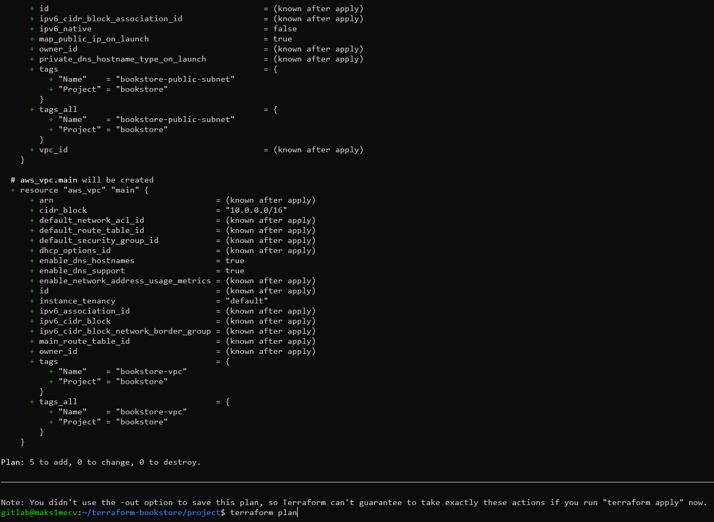 | `terraform plan` — нові ресурси без помилок |
| 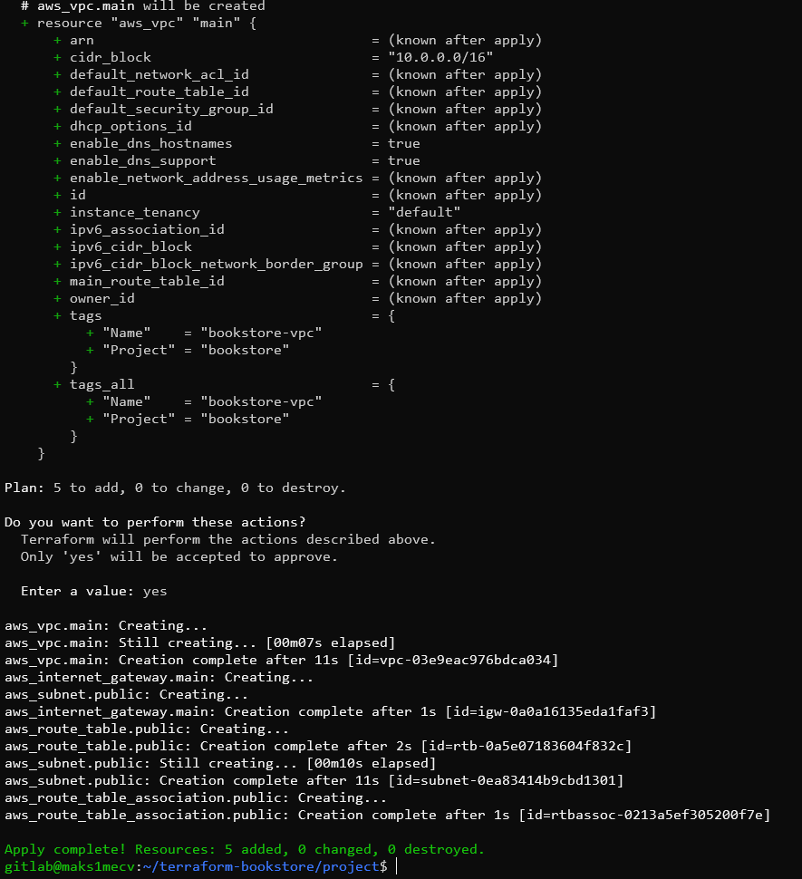 | `terraform apply` — VPC створена |
| 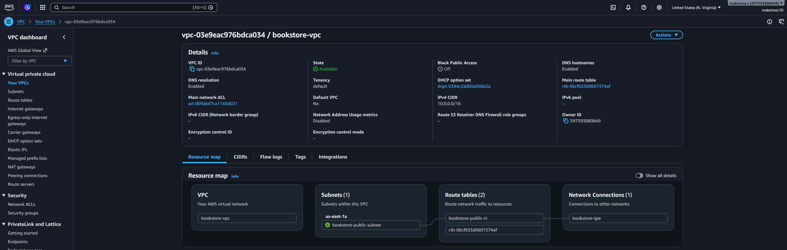 | AWS Console — VPC `bookstore-vpc`, статус available |
| 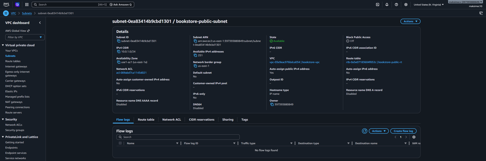 | AWS Console — subnet `bookstore-public-subnet` |
| 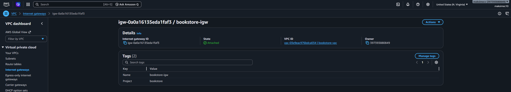 | AWS Console — Internet Gateway, attached до VPC |

---

## Крок 3 — EC2 з SSH ключем

**Мета:** Запустити два EC2-інстанси (web, db) з автоматично згенерованим SSH ключем і Security Groups.

### SSH ключ

```hcl
resource "tls_private_key" "bookstore" {
  algorithm = "RSA"
  rsa_bits  = 4096
}

resource "local_file" "private_key" {
  content         = tls_private_key.bookstore.private_key_pem
  filename        = "${path.module}/keys/bookstore.pem"
  file_permission = "0600"
}
```

Файл `keys/bookstore.pem` зберігається локально. Каталог `keys/` занесений у `.gitignore`.

### .gitignore

```
keys/
*.pem
*.tfstate
*.tfstate.backup
*.tfvars
.terraform/
.terraform.lock.hcl
```

### Security Groups

| SG | Inbound |
|---|---|
| `bookstore-web-sg` | TCP 22, 80, 443 ← `0.0.0.0/0` |
| `bookstore-db-sg` | TCP 22 ← `0.0.0.0/0`; TCP 5432 ← `bookstore-web-sg` |

### Outputs

```hcl
output "ssh_web" {
  value = "ssh -i keys/bookstore.pem ubuntu@${aws_instance.web.public_ip}"
}

output "ssh_db" {
  value = "ssh -i keys/bookstore.pem ubuntu@${aws_instance.db.public_ip}"
}
```

### Підтвердження

| Скріншот | Опис |
|---|---|
| 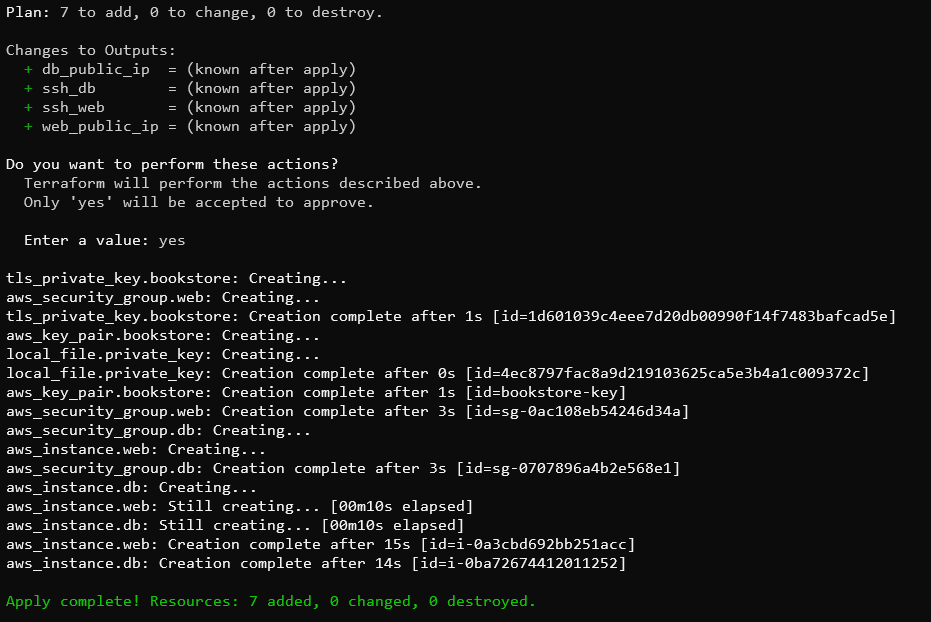 | `terraform apply` — EC2 інстанси запущені |
| 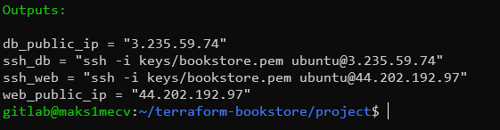 | `terraform output` — `ssh_web`, `ssh_db` |
| 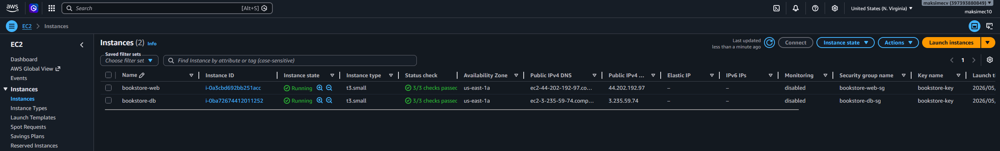 | AWS Console — обидва інстанси Running |
| 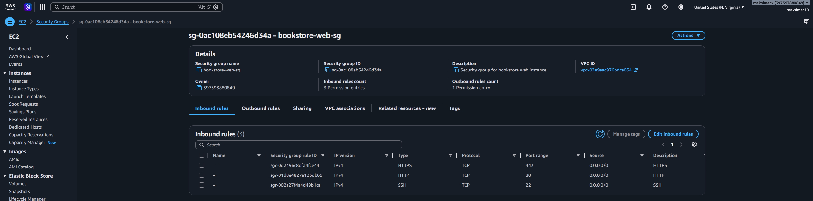 | AWS Console — SG для web-інстансу |
| 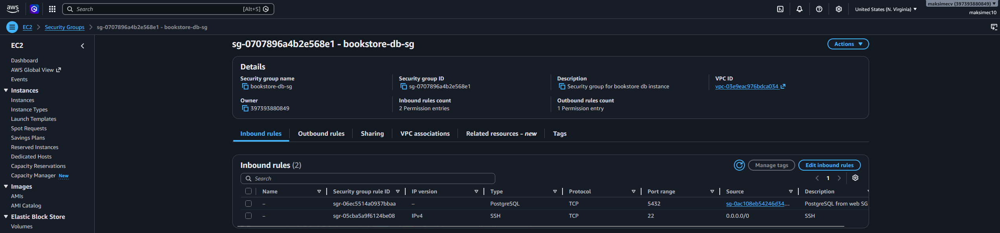 | AWS Console — SG для db-інстансу |
| 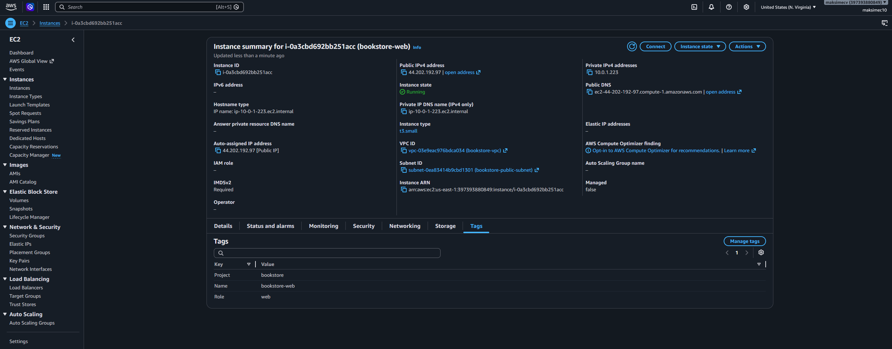 | AWS Console — теги `Role=web`, `Project=bookstore` |
| 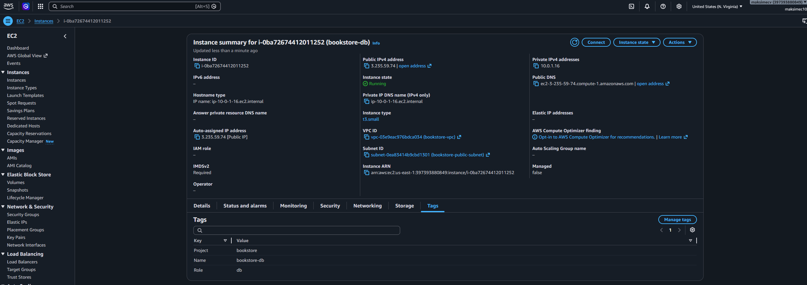 | AWS Console — теги `Role=db`, `Project=bookstore` |
| 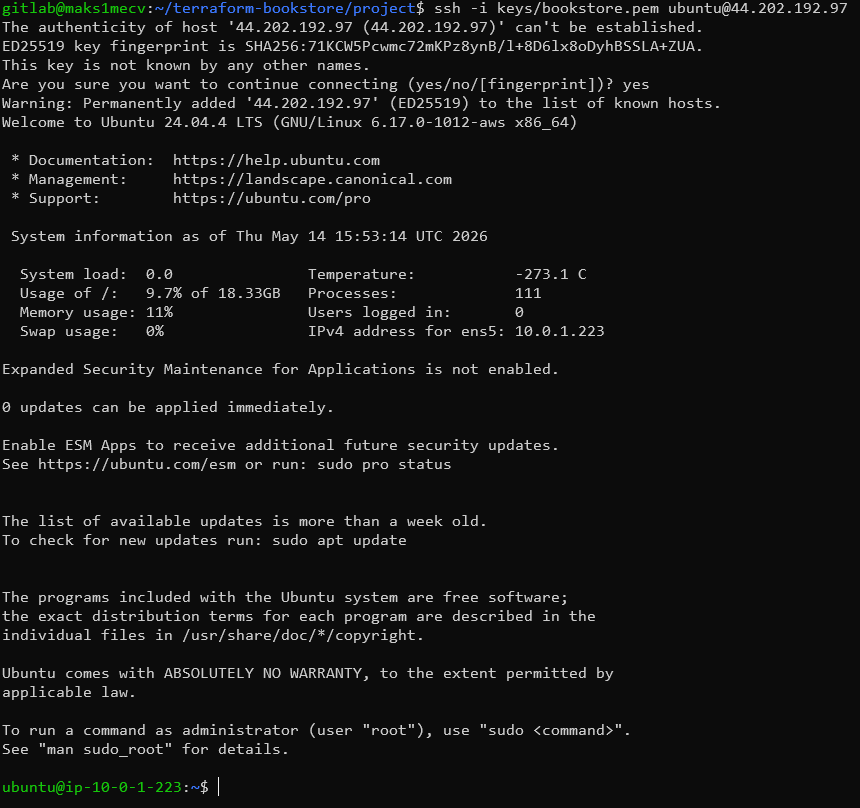 | Успішне SSH-підключення до web-інстансу |
| 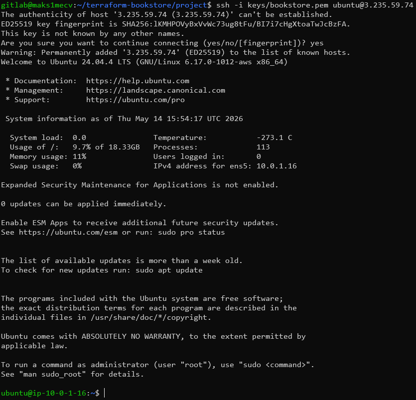 | Успішне SSH-підключення до db-інстансу |

---

## Крок 4 — Ansible provisioning через Terraform

**Мета:** Автоматично запускати Ansible playbook після піднімання EC2. Розгортає повний Bookstore application stack.

### Механізм запуску

`null_resource.ansible_provisioning` у `ansible.tf` виконує `ansible-playbook` через `local-exec` після того, як SSH на обидва інстанси стає доступним.

Terraform передає критичні змінні через `-e`:
- `db_host` — **private IP** db-інстансу (для внутрішнього трафіку VPC)
- `bookstore_domain` — домен з `var.bookstore_domain`

```hcl
provisioner "local-exec" {
  command = <<-EOT
    export ANSIBLE_HOST_KEY_CHECKING=False
    export ANSIBLE_VAULT_PASSWORD_FILE=${var.vault_password_file}
    ansible-playbook \\
      -i .../ansible-bookstore/inventory/ \\
      .../ansible-bookstore/site.yml \\
      --private-key ${local_file.private_key.filename} \\
      -e "db_host=${aws_instance.db.private_ip}" \\
      -e "bookstore_domain=${var.bookstore_domain}" \\
      -e "ansible_ssh_private_key_file=${local_file.private_key.filename}"
  EOT
}
```

### Що розгортає Ansible (site.yml)

| Play | Хост | Роль |
|---|---|---|
| Bootstrap Docker | web + db | `docker` — Docker Engine, Compose Plugin, swap 1 GB |
| Deploy PostgreSQL | db | `postgres` — PostgreSQL 16, init.sql |
| GitLab SSH key | web | `ssh_setup` — deploy key з S3 |
| Application stack | web | `bookstore` — git clone, .env, docker-compose.override.yml |
| Monitoring | web | `monitoring` — supervisord: disk/RAM/log watcher |
| Nginx + TLS | web | `nginx` — nginx-proxy, acme-companion, bookstore-nginx |

### Підтвердження

| Скріншот | Опис |
|---|---|
| 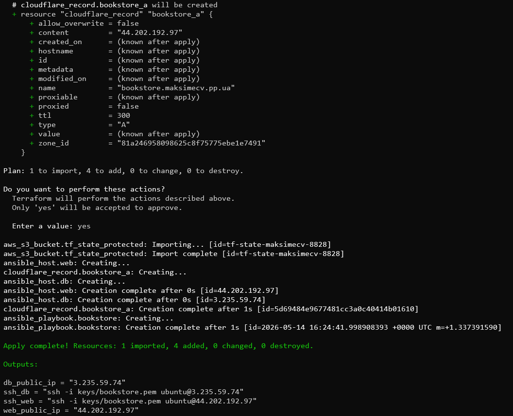 | `terraform apply` — ansible provisioning виконано |
| 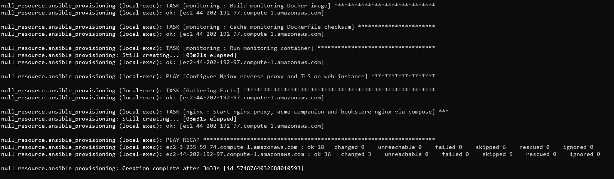 | `PLAY RECAP` — обидва хости, 0 failed |
| 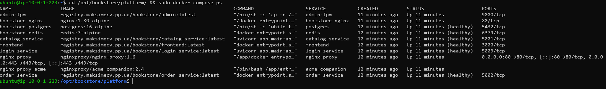 | `docker compose ps` на web — всі сервіси healthy |
| 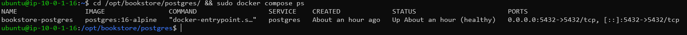 | `docker compose ps` на db — postgres healthy |
| 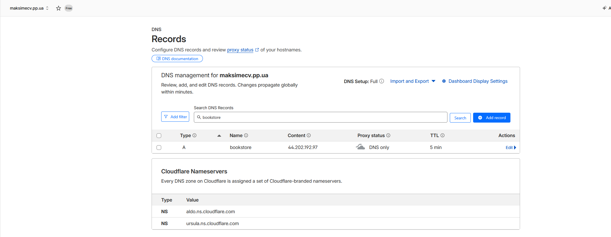 | Cloudflare — A-record для домену |
| 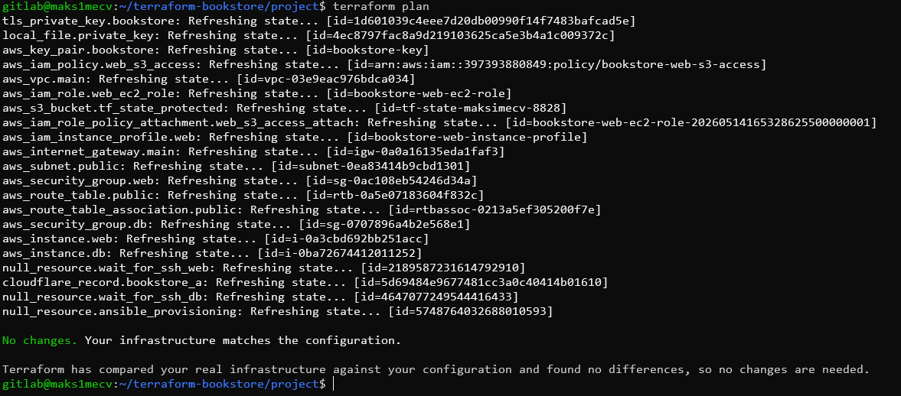 | `terraform plan` після apply — No changes |

---

## Крок 5 — State Management: import та rename

**Мета:** Продемонструвати `terraform import` та `terraform state mv` — управління існуючими ресурсами без recreate.

### 5.1 Секрет створений вручну в AWS Console

AWS Console → Secrets Manager → Store a new secret:
- Type: **Other type of secret**
- Key: `password`, Value: `ChangeMeStrong123`
- Secret name: `bookstore-secret`

### 5.2 Import до Terraform state

```bash
terraform import \\
  aws_secretsmanager_secret.db_password \\
  arn:aws:secretsmanager:arn:aws:secretsmanager:us-east-1:XXXXXXXXXXXXXX:secret:bookstore-secret-yKI2jc
```

Після import `terraform plan` показує `No changes`.

### 5.3 Rename через state mv

```hcl
# secrets.tf — перейменовано з db_password на app_secret
resource "aws_secretsmanager_secret" "app_secret" {
  name = "bookstore/app-secret"
}
```

```bash
terraform state mv \\
  aws_secretsmanager_secret.db_password \\
  aws_secretsmanager_secret.app_secret
```

Результат: `Successfully moved 1 object(s).`
Повторний `terraform plan` → `No changes.`

### Підтвердження

| Скріншот | Опис |
|---|---|
| 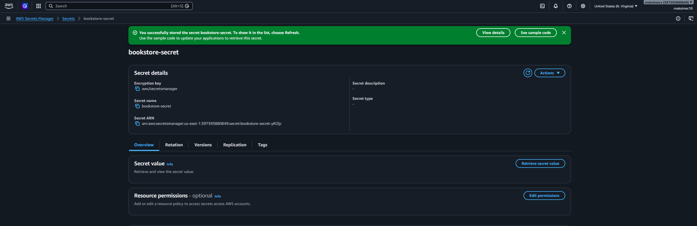 | AWS Console — секрет `bookstore-secret` створений вручну |
| 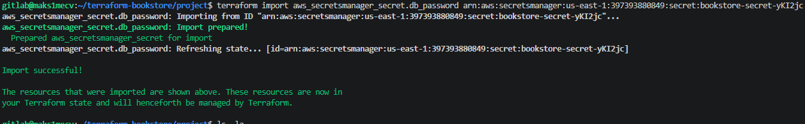 | `terraform import` — `Import successful!` |
| 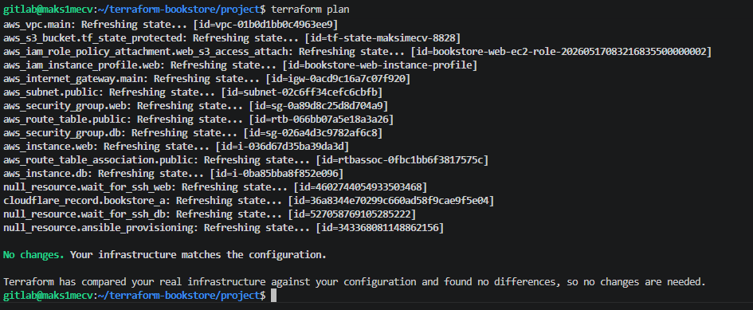 | `terraform plan` після import, до mv — No changes |
| 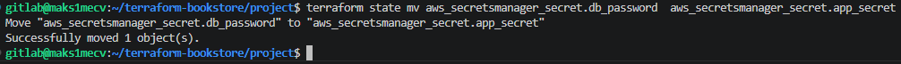 | `terraform state mv` — Successfully moved 1 object(s) |
| 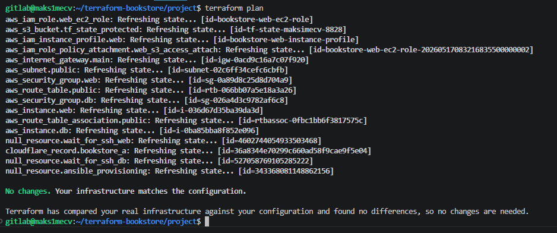 | `terraform plan` після mv — No changes |
| 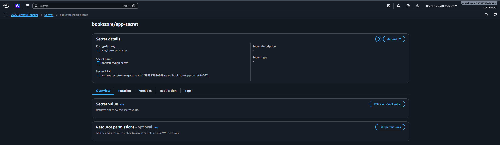 | AWS Console — секрет без змін після rename |

---

## Бонуси

### ⭐ `terraform fmt` та `terraform validate`

```bash
terraform fmt -recursive
terraform validate
```

| Скріншот | Опис |
|---|---|
| 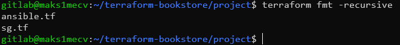 | `terraform fmt` — список відформатованих файлів |
| 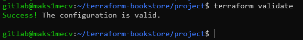 | `terraform validate` — `Success! The configuration is valid.` |

### ⭐ `lifecycle { prevent_destroy = true }` на S3 state bucket

S3 bucket для remote state захищений від випадкового видалення:

| Скріншот | Опис |
|---|---|
| 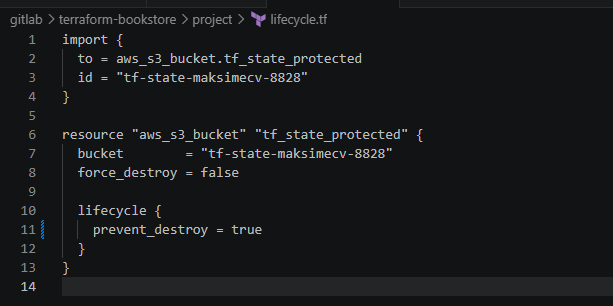 | Вміст файлу `lifecycle.tf` |

### ⭐ `terraform destroy`

Повне видалення всієї інфраструктури (окрім захищеного S3 bucket).

| Скріншот | Опис |
|---|---|
| 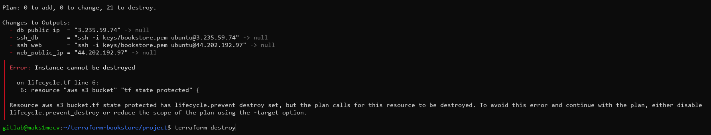 | `terraform destroy` |

---

## Definition of Done

- [x] S3 bucket створений через Terraform, remote state активний
- [x] VPC, subnet, IGW, route table — підняті через Terraform (Варіант B)
- [x] EC2 web та db запущені, SSH ключ збережений у `keys/`
- [x] `keys/` та `*.pem` у `.gitignore`
- [x] Output `ssh_web` та `ssh_db` містять готові команди підключення
- [x] SSH підключення до обох інстансів успішне
- [x] Ansible playbook запускається автоматично після `terraform apply`
- [x] Bookstore application stack розгорнутий — підтверджено через `docker compose ps`
- [x] Секрет `bookstore/app-secret` імпортований — `terraform plan` No changes
- [x] Ресурс перейменований через `terraform state mv` без recreate
- [x] README з описом структури проєкту
- [x] ⭐ `terraform fmt` та `terraform validate` — пройдені
- [x] ⭐ `lifecycle { prevent_destroy = true }` на S3 bucket
- [x] ⭐ `terraform destroy` виконаний успішно

---

## Файлова структура

```
INT26-39/
├── README.md
├── step1/
│   ├── remote-state_terraform_apply.png   # terraform apply у remote-state/
│   ├── project_terraform_init.png         # terraform init — міграція state до S3
│   ├── s3_bucket_versioning.png           # AWS Console — S3 versioning enabled
│   └── s3_bucket_encryption.png           # AWS Console — S3 encryption enabled
├── step2/
│   ├── project_terraform_plan.png         # terraform plan — нові ресурси
│   ├── project_terraform_apply.png        # terraform apply — VPC створена
│   ├── s3_cli_ls_tfstate.png              # aws s3 ls — dev/terraform.tfstate
│   ├── vpc_available.png                  # AWS Console — VPC available
│   ├── vpc_subnet_available.png           # AWS Console — subnet available
│   └── vpc_igw_attached.png               # AWS Console — IGW attached
├── step3/
│   ├── project_terraform_apply.png        # terraform apply — EC2 запущені
│   ├── project_terraform_apply_outputs.png # terraform output — ssh_web, ssh_db
│   ├── ec2_instances_running.png          # AWS Console — обидва інстанси Running
│   ├── ec2_bookstore-web_sg.png           # AWS Console — SG web
│   ├── ec2_bookstore-db_sg.png            # AWS Console — SG db
│   ├── ec2_bookstore-web_tags.png         # AWS Console — теги web
│   ├── ec2_bookstore-db_tags.png          # AWS Console — теги db
│   ├── bookstore-web_sshcon_success.png   # SSH підключення до web
│   └── bookstore-db_sshcon_success.png    # SSH підключення до db
├── step4/
│   ├── terraform_apply.png                # terraform apply — ansible provisioning
│   ├── ansible_play_recap.png             # PLAY RECAP — 0 failed
│   ├── bookstore-web_docker_compose_ps.png # docker compose ps на web
│   ├── bookstore-db_docker_compose_ps.png  # docker compose ps на db
│   ├── cloudflare_a_record.png            # Cloudflare — A-record
│   └── terraform_plan_no_changes.png      # terraform plan — No changes
├── step5/
│   ├── aws_sm_created_secret.png          # AWS Secrets Manager — секрет створений
│   ├── terraform_import.png               # terraform import — Import successful
│   ├── terraform_plan_before_mv.png       # terraform plan після import — No changes
│   ├── terraform_state_mv.png             # terraform state mv — Successfully moved
│   ├── terraform_plan_after_mv.png        # terraform plan після mv — No changes
│   └── aws_sm_secret_after_mv.png         # AWS Console — секрет без змін після mv
└── bonus/
    ├── terraform_fmt.png                  # terraform fmt — відформатовані файли
    ├── terraform_validate.png             # terraform validate — Success
    ├── lifecycle_prevent_destroy.png      # destroy -target — Error: prevent_destroy
    └── terraform_destroy.png             # terraform destroy — Destroy complete
```
