# INT26-45 — Kubernetes: розгортання кластера вручну

---

## Зміст

- [Архітектура проєкту](#архітектура-проєкту)
- [Крок 0 — Інфраструктура (Terraform + AWS)](#крок-0--інфраструктура-terraform--aws)
- [Крок 1 — Kubernetes Control Plane (kubeadm init)](#крок-1--kubernetes-control-plane-kubeadm-init)
- [Крок 2 — Підключення Worker Nodes (kubeadm join)](#крок-2--підключення-worker-nodes-kubeadm-join)
- [Крок 3 — Базова підготовка кластера](#крок-3--базова-підготовка-кластера)
- [Крок 4 — Розгортання застосунку з власного registry](#крок-4--розгортання-застосунку-з-власного-registry)
- [Крок 5 — Операції: Scaling, Rolling Update, Rollback, Self-healing](#крок-5--операції-scaling-rolling-update-rollback-self-healing)
- [Крок 6 — Helm](#крок-6--helm)
- [Крок 7 — Gateway API + TLS](#крок-7--gateway-api--tls)
- [Крок 8 — RBAC: ServiceAccount та Role](#крок-8--rbac-serviceaccount-та-role)
- [Definition of Done](#definition-of-done)
- [Файлова структура](#файлова-структура)

---

## Архітектура проєкту

```
Terraform (AWS)
        │
        ├── EC2 Instances
        │   ├── control-plane  (t3.medium, role=control-plane)
        │   ├── worker-1       (t3.small,  role=app)
        │   └── worker-2       (t3.small,  role=db)
        │
        ├── AWS NLB (Network Load Balancer)
        │   └── Forwards :80 → NodePort 30580
        │       Forwards :443 → NodePort 30963
        │
        └── Cloudflare DNS (via API + SSM Parameter Store)
            └── CNAME maksimecv.pp.ua → NLB DNS name


Kubernetes Cluster (kubeadm, v1.35)
        │
        ├── kube-system
        │   ├── Calico CNI          (pod network 192.168.0.0/16)
        │   └── CoreDNS
        │
        ├── cert-manager
        │   └── ClusterIssuer letsencrypt-prod (ACME HTTP-01 via Gateway API)
        │
        ├── envoy-gateway-system
        │   └── Envoy Gateway v1.8.0 (Gateway API implementation)
        │
        └── bookstore
            ├── GatewayClass envoy
            ├── Gateway bookstore-gateway  (:80 HTTP → redirect, :443 HTTPS)
            ├── HTTPRoute bookstore-routes
            ├── Deployments: frontend, catalog, order, login, admin
            ├── StatefulSet: postgres
            ├── Deployment:  redis
            ├── Services (ClusterIP)
            ├── ConfigMap bookstore-config
            ├── Secret bookstore-secret
            ├── Secret docker-registry (imagePullSecret)
            └── RBAC: ServiceAccount, Role, RoleBinding
```

### Топологія мережі

```
Internet
    │
    ▼
Cloudflare DNS
CNAME maksimecv.pp.ua → NLB DNS
    │
    ▼
AWS Network Load Balancer
  :80  → NodePort 30580 (HTTP → redirect to HTTPS)
  :443 → NodePort 30963 (HTTPS)
    │
    ▼
Envoy Gateway (NodePort Service)
  envoy-gateway-system
    │
    ▼
Gateway bookstore-gateway (namespace: bookstore)
  listeners: http/:80, https/:443 + TLS terminate (bookstore-tls secret)
    │
    ▼
HTTPRoute bookstore-routes
  /api/catalog  → catalog-service:5001
  /api/orders   → order-service:5002
  /api/auth     → login-service:5003
  /admin        → admin-service:80
  /             → frontend-service:3000
    │
    ▼
Pods (власний registry: registry.maksimecv.pp.ua/bookstore/*)
```

---

## Крок 0 — Інфраструктура (Terraform + AWS)

**Мета:** Підготувати всю хмарну інфраструктуру для кластера через IaC перед ручним підняттям Kubernetes.

### Що розгортається

| Ресурс | Опис |
|--------|------|
| `aws_vpc` | VPC `10.0.0.0/16` з публічними subnet |
| `aws_instance × 3` | control-plane + 2 worker nodes |
| `aws_lb` (NLB) | Network Load Balancer для :80 і :443 |
| `aws_lb_target_group` | Target groups з NodePort 30580 / 30963 |
| `aws_ssm_parameter` | Зберігає Cloudflare API token + Zone ID |
| `cloudflare_record` | CNAME `maksimecv.pp.ua` → NLB DNS |

### Cloudflare DNS через SSM

Terraform підтягує Cloudflare credentials із AWS SSM Parameter Store — API token і Zone ID не хардкодяться у `terraform.tfvars`:

```hcl
data "aws_ssm_parameter" "cf_api_token" {
  name = "/bookstore/cloudflare/api_token"
}

data "aws_ssm_parameter" "cf_zone_id" {
  name = "/bookstore/cloudflare/zone_id"
}

resource "cloudflare_record" "bookstore" {
  zone_id = data.aws_ssm_parameter.cf_zone_id.value
  name    = "maksimecv.pp.ua"
  value   = aws_lb.bookstore.dns_name
  type    = "CNAME"
  proxied = false
}
```

---

## Крок 1 — Kubernetes Control Plane (kubeadm init)

**Мета:** Підняти Control Plane вручну через `kubeadm`, щоб розуміти кожен компонент — etcd, kube-apiserver, kube-scheduler, controller-manager.

> Кластер розгортається вручну за допомогою [Step-by-Step Guide: Installing Kubernetes on Ubuntu 24.04 LTS](https://www.linkedin.com/pulse/step-by-step-guide-installing-kubernetes-ubuntu-2404-lts-jayaraman-okozc) з однією суттєвою відміною: замість Kubernetes **1.30** використовується **1.35** — номер версії змінюється безпосередньо в URL apt-репозиторію (`pkgs.k8s.io/core:/stable:/v1.35/deb/`).

### Підготовка ноди (всі ноди)

Один рядок — підготовка ОС, containerd, kubeadm/kubelet/kubectl:

```bash
sudo apt update && sudo apt upgrade -y && sudo swapoff -a && sudo sed -i '/ swap / s/^\(.*\)$/#\1/g' /etc/fstab && echo -e "overlay\\nbr_netfilter" | sudo tee /etc/modules-load.d/containerd.conf >/dev/null && sudo modprobe overlay && sudo modprobe br_netfilter && printf "net.bridge.bridge-nf-call-ip6tables = 1\\nnet.bridge.bridge-nf-call-iptables = 1\\nnet.ipv4.ip_forward = 1\\n" | sudo tee /etc/sysctl.d/kubernetes.conf >/dev/null && sudo sysctl --system && sudo apt install -y curl gnupg2 software-properties-common apt-transport-https ca-certificates && sudo curl -fsSL https://download.docker.com/linux/ubuntu/gpg | sudo gpg --dearmour -o /etc/apt/trusted.gpg.d/docker.gpg && sudo add-apt-repository "deb [arch=amd64] https://download.docker.com/linux/ubuntu $(lsb_release -cs) stable" && sudo apt update && sudo apt install -y containerd.io && sudo mkdir -p /etc/containerd && sudo containerd config default | sudo tee /etc/containerd/config.toml >/dev/null && sudo sed -i 's/SystemdCgroup = false/SystemdCgroup = true/g' /etc/containerd/config.toml && sudo systemctl restart containerd && sudo systemctl enable containerd && sudo install -d -m 0755 /etc/apt/keyrings && curl -fsSL https://pkgs.k8s.io/core:/stable:/v1.35/deb/Release.key | sudo gpg --dearmor -o /etc/apt/keyrings/kubernetes-apt-keyring.gpg && echo "deb [signed-by=/etc/apt/keyrings/kubernetes-apt-keyring.gpg] https://pkgs.k8s.io/core:/stable:/v1.35/deb/ /" | sudo tee /etc/apt/sources.list.d/kubernetes.list >/dev/null && sudo apt update && sudo apt install -y kubelet kubeadm kubectl && sudo apt-mark hold kubelet kubeadm kubectl
```

### Ініціалізація (тільки на control-plane)

```bash
sudo kubeadm init && mkdir -p $HOME/.kube && sudo cp -i /etc/kubernetes/admin.conf $HOME/.kube/config && sudo chown $(id -u):$(id -g) $HOME/.kube/config && kubectl apply -f https://raw.githubusercontent.com/projectcalico/calico/v3.25.0/manifests/calico.yaml && kubectl get nodes
```

**Calico** — CNI-плагін, що призначає IP-адреси pods і забезпечує pod-to-pod мережу. Без CNI всі pods залишаються у стані `Pending`.

### Підтвердження

| Скріншот | Опис |
|----------|------|
| 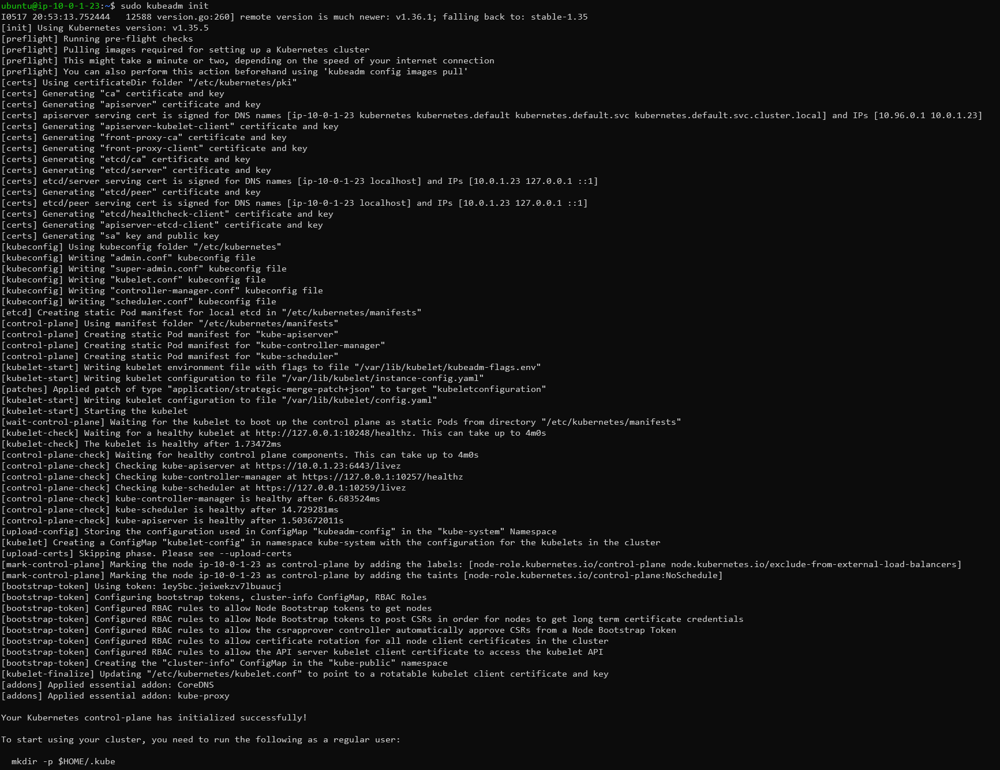 | `kubeadm init` — Control Plane успішно ініціалізовано |

---

## Крок 2 — Підключення Worker Nodes (kubeadm join)

**Мета:** Приєднати worker nodes до кластера та розподілити навантаження.

### Команда join

На control-plane отримуємо команду:

```bash
kubeadm token create --print-join-command
```

На кожній worker-ноді виконуємо отриману команду з `sudo`. Після підключення — `kubectl get nodes` на control-plane показує всі ноди у статусі `Ready`.

### Підтвердження

| Скріншот | Опис |
|----------|------|
| 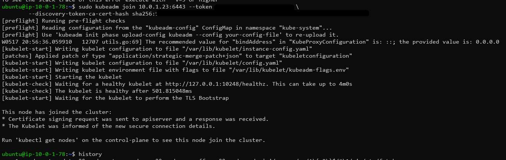 | Worker node 1 — `kubeadm join` виконано |
| 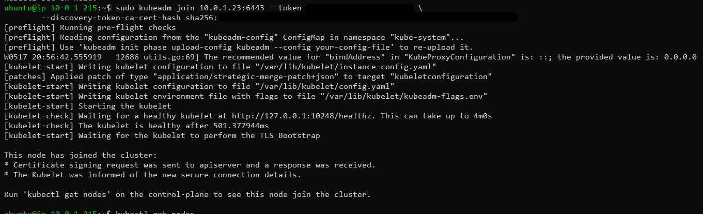 | Worker node 2 — `kubeadm join` виконано |
| 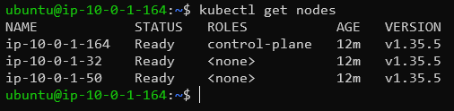 | `kubectl get nodes` — всі ноди у статусі `Ready` |

---

## Крок 3 — Базова підготовка кластера

**Мета:** Налаштувати namespace, node labels, storage provisioner, Helm та задеплоїти базові ресурси застосунку.

### Node Labels

Worker nodes отримують ролі через labels — scheduler розміщує pods на потрібних нодах:

```bash
kubectl label node <worker-1> role=app
kubectl label node <worker-2> role=db
```

Pods з `nodeSelector: role: db` (postgres) розміщуються на db-ноді, решта — на app-ноді.

### Local Path Provisioner

```bash
kubectl apply -f https://raw.githubusercontent.com/rancher/local-path-provisioner/v0.0.31/deploy/local-path-storage.yaml && kubectl patch storageclass local-path -p \'{"metadata": {"annotations":{"storageclass.kubernetes.io/is-default-class":"true"}}}\'
```

Потрібен для динамічного provisioning PVC для PostgreSQL StatefulSet.

### Встановлення Helm

```bash
sudo apt-get install curl gpg apt-transport-https --yes && curl -fsSL https://packages.buildkite.com/helm-linux/helm-debian/gpgkey | gpg --dearmor | sudo tee /usr/share/keyrings/helm.gpg > /dev/null && echo "deb [signed-by=/usr/share/keyrings/helm.gpg] https://packages.buildkite.com/helm-linux/helm-debian/any/ any main" | sudo tee /etc/apt/sources.list.d/helm-stable-debian.list && sudo apt-get update && sudo apt-get install helm
```

### GitLab repo та базові YAML

Маніфести зберігаються у приватному GitLab-репозиторії `gitlab.com/bookstore-maksimec/kubernetes`:

```bash
cd ~/kubernetes/bookstore
kubectl apply -f bookstore-secrets.yaml && kubectl apply -f bookstore-configmap.yaml && kubectl apply -f postgres.yaml && kubectl apply -f postgres-service.yaml && kubectl apply -f redis.yaml
kubectl rollout status statefulset/postgres -n bookstore && kubectl rollout status deployment/redis -n bookstore
kubectl apply -f init-job.yaml && kubectl wait --for=condition=complete job/bookstore-init-db -n bookstore --timeout=120s
```

`postgres-service.yaml` — окремий `ClusterIP` Service для StatefulSet postgres, потрібний для DNS-доступу мікросервісів до БД (`postgres.bookstore.svc.cluster.local`).

---

## Крок 4 — Розгортання застосунку з власного registry

**Мета:** Задеплоїти Bookstore microservices з приватного self-hosted Docker registry через Helm chart з imagePullSecrets, ConfigMap та Secret.

### Self-hosted registry

Всі образи зберігаються на `registry.maksimecv.pp.ua/bookstore/*`. Для pull з приватного registry у кластері потрібен `imagePullSecret`:

```bash
kubectl create secret docker-registry docker-registry \\
  --docker-server=registry.maksimecv.pp.ua \\
  --docker-username=registryuser \\
  --docker-password=\'<PASSWORD>\' \\
  --namespace=bookstore
```

У Helm chart кожен Deployment використовує цей secret:

```yaml
imagePullSecrets:
  - name: docker-registry
```

### ConfigMap та Secret

| Ресурс | Призначення |
|--------|-------------|
| `bookstore-config` (ConfigMap) | Нечутлива конфігурація: DB_HOST, REDIS_HOST, APP_ENV |
| `bookstore-secret` (Secret) | Чутливі дані: DB_PASSWORD, SECRET_KEY (base64) |

Обидва монтуються в контейнери через `envFrom`:

```yaml
envFrom:
  - configMapRef:
      name: bookstore-config
  - secretRef:
      name: bookstore-secret
```

### Helm chart: bookstore-app

Структура chart покриває всі 5 мікросервісів:

```
bookstore-app/
├── Chart.yaml
├── values.yaml
└── templates/
    ├── deployment.yaml       # frontend, catalog, order, login (range loop)
    ├── admin-deployment.yaml # admin (init + sidecar: nginx + php-fpm)
    ├── service.yaml
    ├── httproute.yaml
    ├── envoyproxy.yaml
    ├── gateway.yaml
    └── admin-nginx-configmap.yaml
```

### Розгортання

```bash
cd ~/kubernetes/bookstore-app
helm upgrade --install bookstore-app . -n bookstore -f values.yaml
kubectl rollout status deployment/frontend -n bookstore && kubectl rollout status deployment/catalog -n bookstore && kubectl rollout status deployment/order -n bookstore && kubectl rollout status deployment/login -n bookstore && kubectl rollout status deployment/admin -n bookstore
```

### Підтвердження

| Скріншот | Опис |
|----------|------|
| 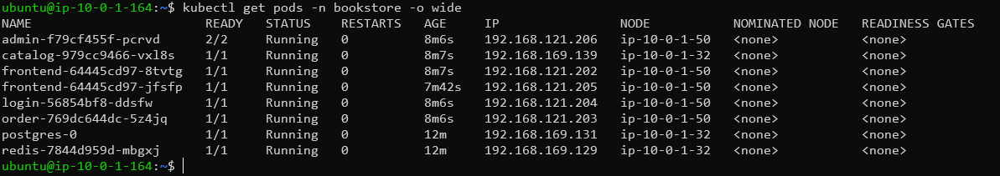 | `kubectl get pods -n bookstore -o wide` — всі pods `Running` |
| 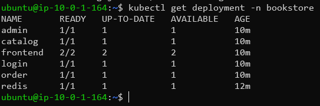 | `kubectl get deployment -n bookstore` — всі Deployments ready |

---

## Крок 5 — Операції: Scaling, Rolling Update, Rollback, Self-healing

**Мета:** Продемонструвати ключові можливості Kubernetes — саме заради них і варто використовувати оркестратор замість Docker Compose.

### Scaling

Kubernetes дозволяє миттєво змінювати кількість реплік без downtime:

```bash
kubectl scale deployment frontend -n bookstore --replicas=3
kubectl get pods -n bookstore | grep frontend
kubectl scale deployment frontend -n bookstore --replicas=2
```

### Rolling Update

Оновлення без downtime — новий pod піднімається раніше, ніж старий зупиняється (`maxSurge: 1`, `maxUnavailable: 0`):

```bash
kubectl set image deployment/frontend frontend=registry.maksimecv.pp.ua/bookstore/frontend:v2 -n bookstore
kubectl rollout status deployment/frontend -n bookstore
```

### Rollback

Відкат до попередньої версії зберігається в rollout history:

```bash
kubectl rollout history deployment/frontend -n bookstore
kubectl rollout undo deployment/frontend -n bookstore
kubectl rollout status deployment/frontend -n bookstore
```

### Self-healing

Deployment автоматично перезапускає pod при падінні — controller-manager постійно порівнює бажаний стан із поточним:

```bash
kubectl delete pod -n bookstore -l app=frontend
kubectl get pods -n bookstore -w
```

Pod миттєво замінюється новим — `kubectl get pods -w` показує `Terminating` → `ContainerCreating` → `Running`.

### Підтвердження

| Скріншот | Опис |
|----------|------|
| 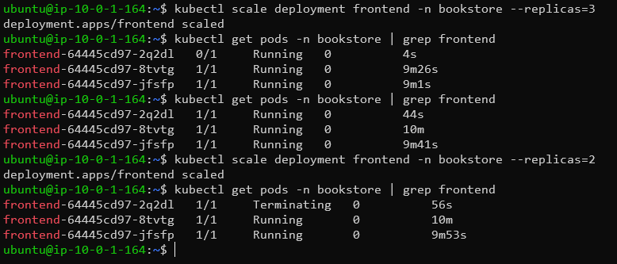 | `kubectl scale` — frontend: 3 replicas, потім повернуто до 2 |
| 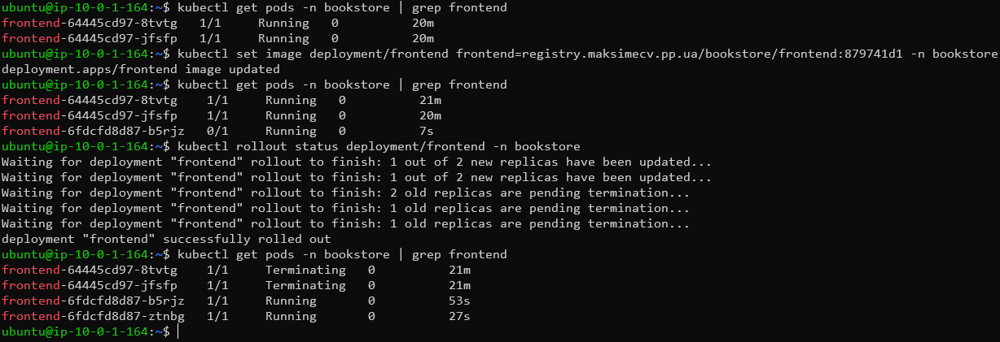 | `kubectl rollout status` — rolling update без downtime |
| 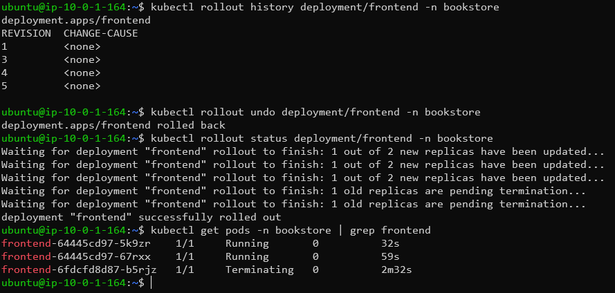 | `kubectl rollout undo` — відкат до попередньої версії |
| 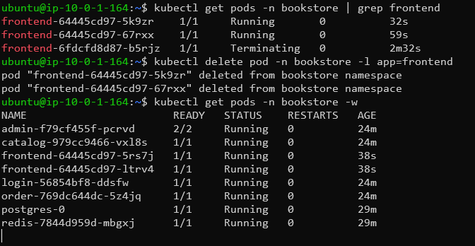 | `kubectl delete pod` → автоматичний перезапуск |

---

## Крок 6 — Helm

**Мета:** ★ Підняти Helm releases, освоїти базову структуру chart і команди.

### Встановлені Helm releases

```bash
helm list -A
```

| Release | Namespace | Chart | Призначення |
|---------|-----------|-------|-------------|
| `bookstore-app` | bookstore | `bookstore-app-0.1.0` | Bookstore microservices stack |
| `cert-manager` | cert-manager | `cert-manager-v1.x` | TLS certificate management |
| `eg` | envoy-gateway-system | `gateway-helm-v1.8.0` | Envoy Gateway controller |

### Cert-manager

```bash
helm repo add jetstack https://charts.jetstack.io && helm repo update && helm upgrade --install cert-manager jetstack/cert-manager --namespace cert-manager --create-namespace --set crds.enabled=true --set "extraArgs={--enable-gateway-api}"
```

### Envoy Gateway

```bash
helm upgrade -i eg oci://docker.io/envoyproxy/gateway-helm --version v1.8.0 -n envoy-gateway-system --create-namespace
```

### Підтвердження

| Скріншот | Опис |
|----------|------|
| 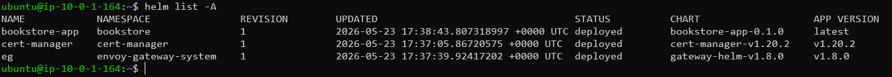 | `helm list -A` — всі Helm releases |

---

## Крок 7 — Gateway API + TLS

**Мета:** ★ Налаштувати сучасний вхідний трафік через Gateway API замість deprecated Nginx Ingress.

> **Nginx Ingress оголошений deprecated у квітні 2026.** Kubernetes проект офіційно рекомендує **Gateway API**. У цьому проєкті використовується **Envoy Gateway** — стандартна реалізація CNCF, обрана як IT Outposts Standard.

### Порядок встановлення

```bash
# 1. Gateway API CRDs (до cert-manager!)
kubectl apply -f https://github.com/kubernetes-sigs/gateway-api/releases/download/v1.2.1/standard-install.yaml

# 2. cert-manager з Gateway API support
helm upgrade --install cert-manager jetstack/cert-manager ... --set "extraArgs={--enable-gateway-api}"

# 3. Envoy Gateway controller
helm upgrade -i eg oci://docker.io/envoyproxy/gateway-helm --version v1.8.0 -n envoy-gateway-system --create-namespace

# 4. Helm chart застосунку (містить GatewayClass, Gateway, HTTPRoute, EnvoyProxy)
helm upgrade --install bookstore-app . -n bookstore -f values.yaml

# 5. ClusterIssuer + Certificate
kubectl apply -f cluster-issuer.yaml && kubectl apply -f certificate.yaml
```

### Ресурси Gateway API

| Ресурс | Kind | Призначення |
|--------|------|-------------|
| `envoy` | GatewayClass | Прив\'язує Gateway до Envoy Gateway controller |
| `bookstore-gateway` | Gateway | Точка входу: HTTP :80 + HTTPS :443 з TLS termination |
| `bookstore-routes` | HTTPRoute | Маршрутизація по path до мікросервісів |
| `bookstore-http-redirect` | HTTPRoute | HTTP → HTTPS redirect (301) |
| `bookstore-envoy-proxy` | EnvoyProxy | Конфігурація Envoy: NodePort, node selector, fixed ports |

### TLS сертифікат

Let\'s Encrypt сертифікат видається автоматично через ACME HTTP-01 challenge, яке cert-manager вирішує через Gateway API (без Ingress):

```bash
kubectl get certificate bookstore-tls -n bookstore
# NAME            READY   SECRET          AGE
# bookstore-tls   True    bookstore-tls   ...
```

### Підтвердження

| Скріншот | Опис |
|----------|------|
| 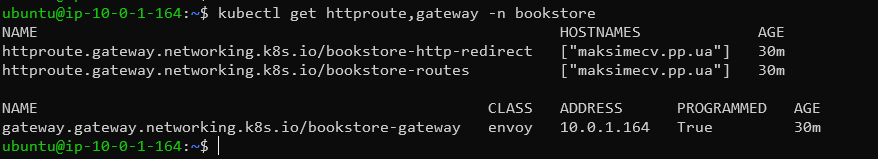 | `kubectl get httproute,gateway -n bookstore` — Gateway API ресурси |
| 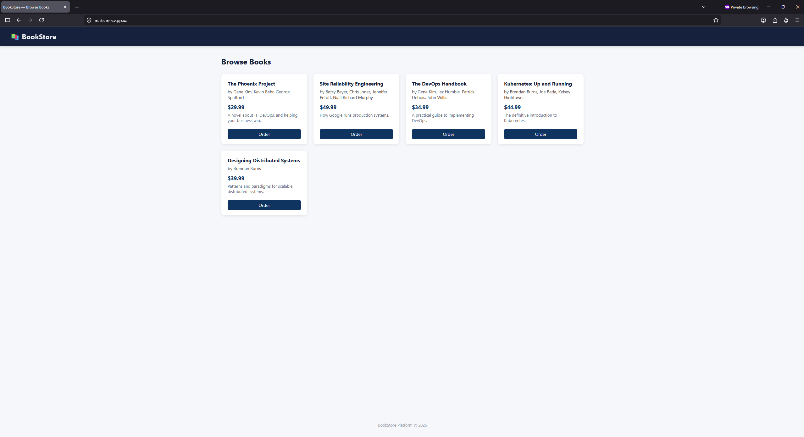 | `https://maksimecv.pp.ua` — застосунок доступний через HTTPS |

---

## Крок 8 — RBAC: ServiceAccount та Role

**Мета:** ★ Налаштувати ServiceAccount і Role з мінімальними правами (principle of least privilege).

### Маніфест

```yaml
apiVersion: v1
kind: ServiceAccount
metadata:
  name: bookstore-app-sa
  namespace: bookstore
---
apiVersion: rbac.authorization.k8s.io/v1
kind: Role
metadata:
  name: bookstore-app-role
  namespace: bookstore
rules:
  - apiGroups: [""]
    resources: ["configmaps"]
    verbs: ["get", "list"]
  - apiGroups: [""]
    resources: ["secrets"]
    verbs: ["get"]
  - apiGroups: [""]
    resources: ["pods"]
    verbs: ["get", "list"]
---
apiVersion: rbac.authorization.k8s.io/v1
kind: RoleBinding
metadata:
  name: bookstore-app-rolebinding
  namespace: bookstore
subjects:
  - kind: ServiceAccount
    name: bookstore-app-sa
    namespace: bookstore
roleRef:
  kind: Role
  apiGroup: rbac.authorization.k8s.io
  name: bookstore-app-role
```

### Принцип мінімальних прав

| Ресурс | Дії | Обґрунтування |
|--------|-----|---------------|
| `configmaps` | `get`, `list` | Читання конфігурації |
| `secrets` | `get` | Читання credentials (тільки get, не list) |
| `pods` | `get`, `list` | Service discovery між мікросервісами |

ServiceAccount `bookstore-app-sa` ізольований від `default` SA — namespace-scoped Role не дає прав на інші namespaces.

```bash
kubectl apply -f ~/kubernetes/bookstore/rbac.yaml
kubectl get serviceaccount,role,rolebinding -n bookstore
```

### Підтвердження

| Скріншот | Опис |
|----------|------|
| 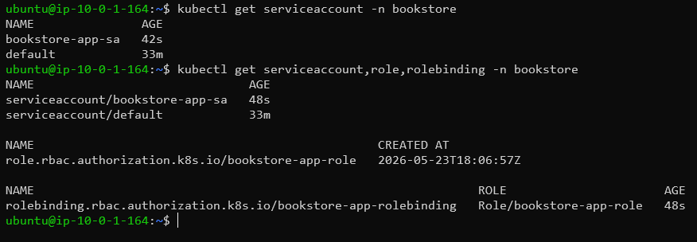 | `kubectl get serviceaccount,role,rolebinding -n bookstore` |

---

## Definition of Done

- [x] `kubeadm init` — Control Plane ініціалізований
- [x] `kubeadm join` — обидва worker nodes підключені та у статусі `Ready`
- [x] `kubectl get nodes` — всі ноди `Ready`
- [x] Calico CNI встановлений — pods отримують IP
- [x] Застосунок з власного registry (`registry.maksimecv.pp.ua`) запущений
- [x] `imagePullSecrets` налаштований для приватного registry
- [x] ConfigMap та Secret змонтовані в контейнери
- [x] Scaling — `kubectl scale` продемонстровано
- [x] Rolling update — `kubectl rollout status` без downtime
- [x] Rollback — `kubectl rollout undo` виконано
- [x] Self-healing — видалений pod автоматично відновлений
- [x] ⭐ Helm releases: `bookstore-app`, `cert-manager`, `eg` (Envoy Gateway)
- [x] ⭐ Gateway API: GatewayClass, Gateway, HTTPRoute, EnvoyProxy
- [x] ⭐ Namespace `bookstore` створений
- [x] ⭐ ServiceAccount `bookstore-app-sa` + Role з мінімальними правами + RoleBinding
- [x] ⭐ TLS сертифікат Let\'s Encrypt через cert-manager + ACME HTTP-01 via Gateway API
- [x] Застосунок доступний через `https://maksimecv.pp.ua`

---

## Файлова структура

```
INT26-45/
├── README.md
└── screenshots/
    ├── controlplane_kubeadm_init.png            # kubeadm init — Control Plane ініціалізовано
    ├── worker1_kubeadmin_join.png               # Worker node 1 — kubeadm join
    ├── worker2_kubeadmin_join.png               # Worker node 2 — kubeadm join
    ├── controlplane_kubectl_get_nodes.png       # kubectl get nodes — всі ноди Ready
    ├── controlplane_kubectl_get_pods_all_running.png  # kubectl get pods — всі Running
    ├── controlplane_kubectl_get_deployment.png  # kubectl get deployment — всі ready
    ├── controlplane_kubectl_frontend_scale.png  # kubectl scale — 3 replicas → 2
    ├── controlplane_kubectl_rolling_update.png  # kubectl rollout status — rolling update
    ├── controlplane_kubectl_rollout.png         # kubectl rollout undo — rollback
    ├── controlplane_kubectl_selfhealing.png     # kubectl delete pod → auto-restart
    ├── controlplane_helm_list.png               # helm list -A — всі Helm releases
    ├── controlplane_kubectl_get_httproute.png   # Gateway API ресурси
    ├── controlplane_kubectl_get_serviceaccount.png  # RBAC — SA, Role, RoleBinding
    └── website_working.png                      # https://maksimecv.pp.ua — працює
```
