# INT26-47 — GitOps: FluxCD + Image Automation

> Кластер (kubeadm на AWS) уже піднятий в межах попереднього завдання. Тут — вибір
> GitOps-інструмента, його робота, Kustomization, і повний цикл image automation для застосунку `bookstore`.
> Обраний інструмент: **FluxCD** (стандарт на більшості проєктів IT Outposts).

---

## Зміст

- [Архітектура: цикл image automation](#архітектура-цикл-image-automation)
- [Крок 1 — Порівняння ArgoCD vs FluxCD](#крок-1--порівняння-argocd-vs-fluxcd)
- [Крок 2 — Встановлення FluxCD](#крок-2--встановлення-fluxcd)
- [Крок 3 — GitRepository та Kustomization](#крок-3--gitrepository-та-kustomization)
- [Крок 4 — Image Automation](#крок-4--image-automation)
- [Definition of Done](#definition-of-done)
- [Файлова структура](#файлова-структура)

---

## Архітектура: цикл image automation

```
Developer push (app repo) ──► GitLab CI (.docker-build)
                                 └─ build + push:
                                    registry.maksimecv.pp.ua/bookstore/<svc>:main-YYYYMMDD-HHMMSS-<sha>
                                            │
                                            ▼
        image-reflector-controller  ── сканує реєстр (ImageRepository) кожні 5m
                                            │  обирає найновіший тег (ImagePolicy, сортування за ts)
                                            ▼
        image-automation-controller ── переписує tag: у bookstore-app/values.yaml
                                            └─ commit + push у k8s-manifests (fluxcdbot)
                                            │
                                            ▼
        source-controller ── бачить новий коміт у GitRepository flux-system
                                            ▼
        helm-controller   ── re-upgrade HelmRelease bookstore-app
                                            ▼
                              Kubernetes: rolling update Deployment з новим тегом
```

---

## Крок 1 — Порівняння ArgoCD vs FluxCD

**Як працює ArgoCD.** Оператор у кластері з власним UI. Описуєш `Application` CRD (repo URL, branch, path, destination, namespace, sync policy). ArgoCD періодично порівнює стан Git із кластером, показує diff і застосовує його (`automated` або `manual` з апрувом у UI). Має `self-heal` (відкат ручних змін до стану з Git) і `prune` (видалення ресурсів, прибраних з Git).

**Як працює FluxCD.** Набір контролерів (`source-`, `kustomize-`, `helm-`, `notification-`, опційно `image-*`). `GitRepository` описує джерело, `Kustomization`/`HelmRelease` — що і звідки розгортати. Конфігурація повністю декларативна, у Git; UI за замовчуванням немає. З коробки — нативні HelmRelease, multi-cluster і image automation.

**Підхід до GitOps.** Обидва — **pull-модель**: оператор живе всередині кластера і сам стукається до Git, кластер не відкривається назовні, зовнішніх кредів до кластера не треба. (Push-модель — це Jenkins, що `kubectl apply` ззовні.)

**UI.** Зручніший UI — у **ArgoCD** (розвинений, з коробки). У **FluxCD UI за замовчуванням немає** — є зовнішні рішення (Weave GitOps, Flamingo).

| Характеристика | ArgoCD | FluxCD |
|---|---|---|
| UI | ✅ розвинений, з коробки | ❌ немає за замовчуванням (Weave GitOps / Flamingo) |
| Модель | Pull | Pull |
| HelmRelease | обмежено | ✅ нативно |
| Image Automation | через ArgoCD Image Updater | ✅ вбудовано (image-*-controller) |
| Multi-cluster | через ApplicationSet | ✅ нативно |
| CLI | `argocd` | `flux` |
| Старт | простіше (UI) | більше маніфестів, CLI-oriented |

**Обрано: FluxCD.** Причини: це стандарт на більшості проєктів IT Outposts; нативні HelmRelease (застосунок `bookstore` — Helm-чарт) і вбудована image automation без додаткових плагінів; чиста GitOps-конфігурація в Git без кліків у UI.

---

## Крок 2 — Встановлення FluxCD

CLI + перевірка передумов кластера:

```bash
curl -s https://fluxcd.io/install.sh | sudo bash && flux check --pre
```

Bootstrap у GitLab-репозиторій (з image-контролерами одразу):

```bash
flux bootstrap git \
  --url=ssh://git@gitlab.com/bookstore-maksimec/k8s-manifests.git \
  --branch=main \
  --path=clusters/production \
  --private-key-file=/home/ubuntu/.ssh/id_ed25519_flux \
  --components-extra=image-reflector-controller,image-automation-controller
```

Перегляд статусу Flux-ресурсів:

```bash
flux get sources git -A        # стан GitRepository (revision, ready)
flux get kustomizations        # стан Kustomization (applied revision)
flux get helmreleases -A       # стан HelmRelease
flux get all -A                # все разом
kubectl get pods -n flux-system
```

### Підтвердження

| Скріншот | Опис |
|---|---|
| 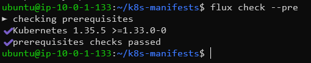 | `flux check --pre` — передумови пройдені |
| 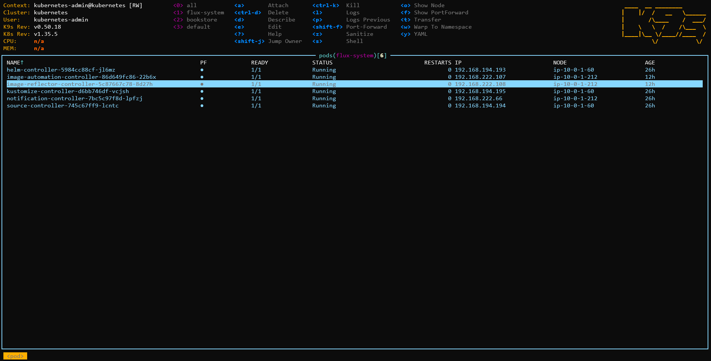 | `flux-system` — усі контролери Running, включно з `image-reflector` та `image-automation` (k9s або `kubectl get pods -n flux-system`) |
| 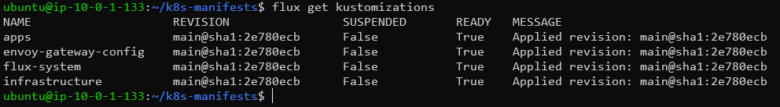 | `flux get kustomizations` — `infrastructure`, `envoy-gateway-config`, `apps` у стані Ready |
| 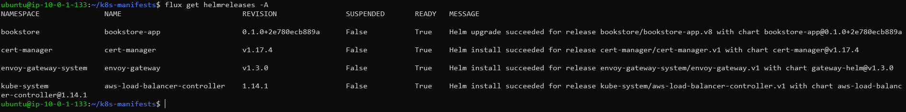 | `flux get helmreleases -A` — усі HelmRelease Ready |

---

## Крок 3 — GitRepository та Kustomization

Репозиторій підключено через `GitRepository/flux-system` (створено bootstrap-ом). Деплой розбито на три `Kustomization` із залежностями та інтервалом перевірки `10m`:

```
clusters/production/
├── infrastructure.yaml        # path ./infrastructure        (interval 10m, prune)
├── envoy-gateway-config.yaml  # dependsOn: infrastructure
└── apps.yaml                  # dependsOn: infrastructure, envoy-gateway-config; path ./apps/bookstore
```

Обов'язкові параметри (на прикладі `apps`): `sourceRef` → `GitRepository/flux-system`, `path: ./apps/bookstore`, `interval: 10m`, `prune: true`, namespace деплою — `bookstore`.

Перевірка джерела та дерева застосованих об'єктів:

```bash
flux get sources git -A
flux tree kustomization apps
```

### Підтвердження

| Скріншот | Опис |
|---|---|
| 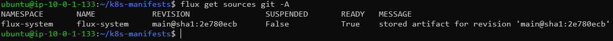 | `flux get sources git -A` — `flux-system` Ready, поточний revision |
| 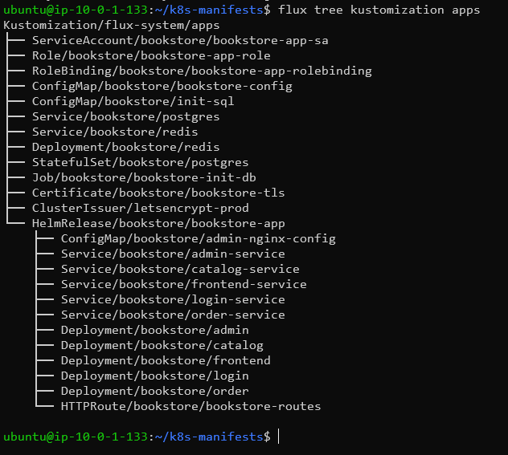 | `flux tree kustomization apps` — дерево ресурсів, що деплоїть Flux (HelmRelease + об'єкти) |

---

## Крок 4 — Image Automation

### 4.1 Сортований тег у CI

У шаблоні `ci-templates/docker-build.yml` білд-джоба пушить **незмінний сортований** тег (раніше був лише `latest` + короткий SHA, який не сортується):

```yaml
  script:
    - export BUILD_TAG="main-$(date -u +%Y%m%d-%H%M%S)-${CI_COMMIT_SHORT_SHA}"
    - docker build -t "$IMAGE_NAME:$BUILD_TAG" -t "$IMAGE_NAME:latest" .
    - docker push "$IMAGE_NAME:$BUILD_TAG"
    - docker push "$IMAGE_NAME:latest"
```

### 4.2 Секрет реєстру для сканування (приватний registry)

```bash
kubectl create secret docker-registry registry-credentials \
  --docker-server=registry.maksimecv.pp.ua \
  --docker-username='<REGISTRY_USER>' --docker-password='<REGISTRY_PASS>' \
  -n flux-system
```

### 4.3 Маркери у `bookstore-app/values.yaml`

Біля поля `tag` кожного сервіса (на тому ж рядку):

```yaml
  frontend:
    image: frontend
    tag: "latest" # {"$imagepolicy": "flux-system:frontend:tag"}
  catalog:
    image: catalog-service
    tag: "latest" # {"$imagepolicy": "flux-system:catalog-service:tag"}
  order:
    image: order-service
    tag: "latest" # {"$imagepolicy": "flux-system:order-service:tag"}
  login:
    image: login-service
    tag: "latest" # {"$imagepolicy": "flux-system:login-service:tag"}
  admin:
    image: admin
    tag: "latest" # {"$imagepolicy": "flux-system:admin:tag"}
```

### 4.4 Маніфести автоматизації

Файл `clusters/production/image-automation.yaml` — по `ImageRepository` + `ImagePolicy` на кожен сервіс і один `ImageUpdateAutomation` на весь чарт. Політика обирає найновіший тег сортуванням за міткою часу:

```yaml
  filterTags:
    pattern: '^main-(?P<ts>[0-9]{8}-[0-9]{6})-[0-9a-f]+$'
    extract: '$ts'
  policy:
    alphabetical:
      order: asc
```

`ImageUpdateAutomation` комітить зміну `tag:` назад у репозиторій (`update.path: ./bookstore-app`, `strategy: Setters`, push у `main`).

### 4.5 Перевірка повного циклу

```bash
# 1) тригеримо білд: коміт у app-repo (напр. frontend) у main → CI пушить main-<ts>-<sha>
# 2) стан автоматизації:
flux get image repository -n flux-system
flux get image policy -n flux-system
flux get image update -n flux-system
# 3) деплой оновився до нового тегу:
kubectl get deploy frontend -n bookstore \
  -o jsonpath='{.spec.template.spec.containers[0].image}{"\n"}'
```

### Підтвердження

| Скріншот | Опис |
|---|---|
| 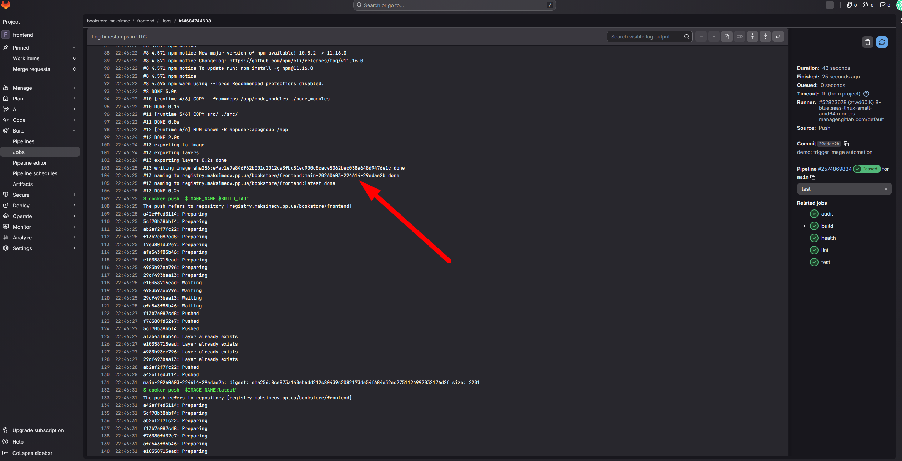 | GitLab CI — джоба `build` запушила тег `main-YYYYMMDD-HHMMSS-<sha>` (видно в логах/артефактах джоби) |
| 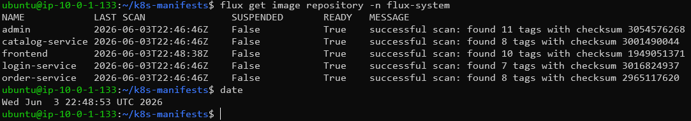 | `flux get image repository -n flux-system` — реєстр відсканований, LAST SCAN, кількість тегів |
| 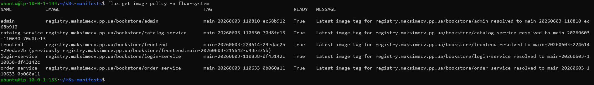 | `flux get image policy -n flux-system` — обраний LATEST IMAGE (новий тег) для кожного сервіса |
| 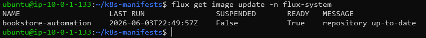 | `flux get image update -n flux-system` — LAST RUN, успішний коміт |
| 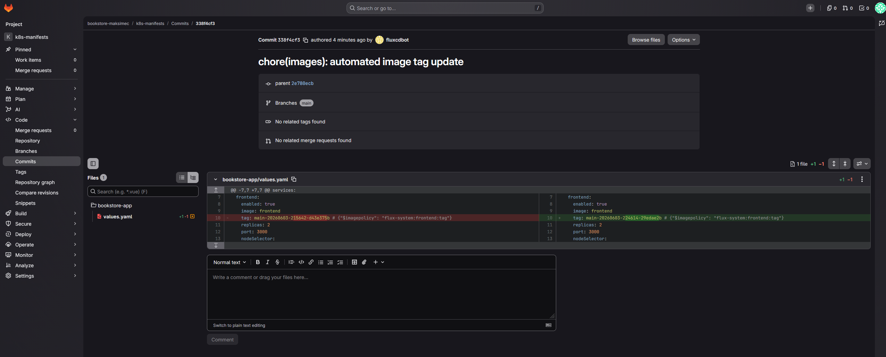 | GitLab — автокоміт `fluxcdbot` у `k8s-manifests`, diff `tag:` у `bookstore-app/values.yaml` |
| 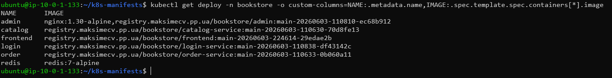 | `kubectl get deploy frontend -o jsonpath ...image` — образ із новим тегом замість `latest` |

---

## Definition of Done

- [ ] Порівняно ArgoCD vs FluxCD (як працюють, pull-модель, плюси/мінуси, UI, чи є UI у Flux за замовчуванням)
- [ ] Вказано обраний інструмент (**FluxCD**) і обґрунтування
- [ ] Flux CLI встановлено, `flux check --pre` пройдено
- [ ] Flux bootstrap у кластер (з image-контролерами)
- [ ] Flux підключено до Git-репозиторію (`GitRepository/flux-system`)
- [ ] Описано, як переглядати статус Flux-ресурсів (`flux get sources/kustomizations/helmreleases`)
- [ ] `Kustomization` дивиться на репозиторій: path, interval, namespace, prune, dependsOn
- [ ] Image automation: `ImageRepository` + `ImagePolicy` + `ImageUpdateAutomation`
- [ ] CI пушить сортований тег у реєстр
- [ ] Автоматизація бачить новий тег і комітить його в Git (автокоміт `fluxcdbot`)
- [ ] Flux синхронізує кластер → Deployment оновлюється до нового образу

---

## Файлова структура

```
INT26-47/
├── README.md
├── step2/
│   ├── flux_check_pre.png            # flux check --pre — передумови ok
│   ├── flux_system_pods.png          # flux-system: усі контролери + image-reflector/automation Running
│   ├── flux_get_kustomizations.png   # flux get kustomizations — Ready
│   └── flux_get_helmreleases.png     # flux get helmreleases -A — Ready
├── step3/
│   ├── flux_get_sources_git.png      # flux get sources git -A — GitRepository Ready
│   └── flux_tree_apps.png            # flux tree kustomization apps — дерево об'єктів
└── step4/
    ├── gitlab_ci_build_tag.png       # CI запушив main-<ts>-<sha>
    ├── flux_get_image_repository.png # реєстр відсканований
    ├── flux_get_image_policy.png     # обраний найновіший тег
    ├── flux_get_image_update.png     # успішний коміт автоматизацією
    ├── gitlab_fluxcdbot_commit.png   # автокоміт fluxcdbot, diff values.yaml
    └── deploy_image_updated.png      # Deployment з новим тегом
```
