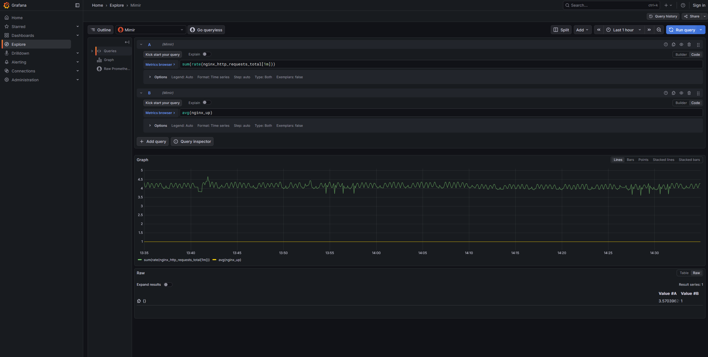
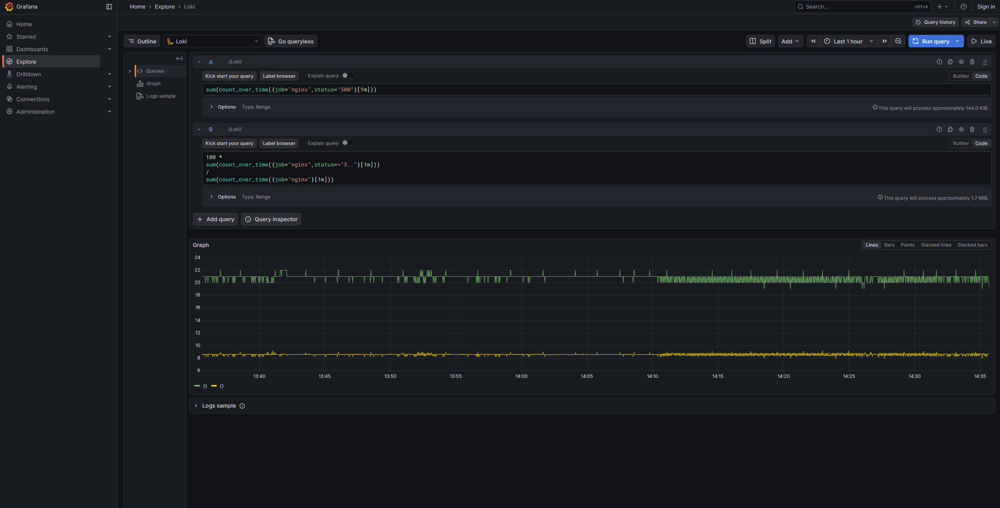
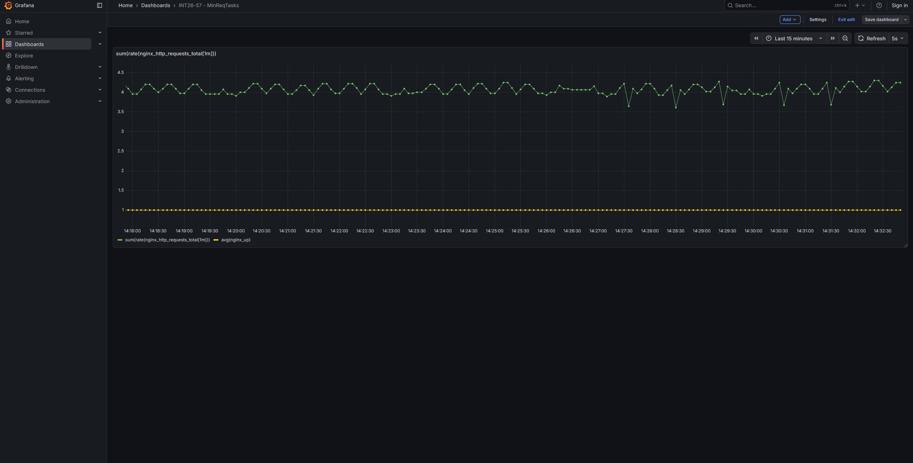
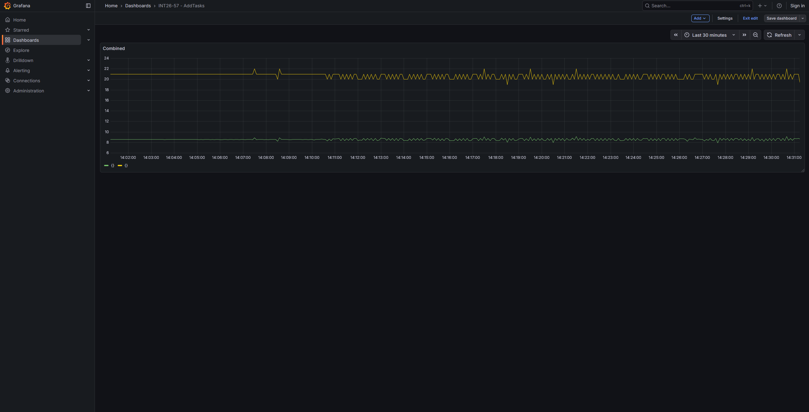

# INT26-57 — Block 7.1: Observability & Monitoring

***

## Зміст

- [Архітектура рішення](#архітектура-рішення)
- [Що було налаштовано](#що-було-налаштовано)
- [Перевірка в Grafana](#перевірка-в-grafana)
- [Дашборди](#дашборди)
- [Підтвердження](#підтвердження)
- [Definition of Done](#definition-of-done)
- [Файлова структура](#файлова-структура)

***

## Архітектура рішення

```text
NGINX ── access/error logs ──► Alloy ──► Loki ──► Grafana
NGINX Exporter ── metrics ──► Alloy ──► Mimir ──► Grafana
```

Alloy збирає метрики з `nginx-exporter:9113` та читає NGINX access/error logs з файлів. Метрики відправляються у Mimir, а логи — у Loki.

***

## Що було налаштовано

- `prometheus.scrape` для `nginx-exporter:9113`.
- `loki.source.file` для NGINX access/error logs.
- `loki.process` для парсингу access log та витягування `status`.
- `loki.write` для відправки логів у Loki.
- `prometheus.remote_write` для відправки метрик у Mimir.

***

## Перевірка в Grafana

### Mimir

```promql
sum(rate(nginx_http_requests_total[1m]))
```

```promql
avg(nginx_up)
```

### Loki

```logql
100 *
sum(count_over_time({job="nginx",status=~"5.."}[1m]))
/
sum(count_over_time({job="nginx"}[1m]))
```

```logql
sum(count_over_time({job="nginx",status="500"}[1m]))
```

***

## Дашборди

### `INT26-57 - MinReqTasks`

Одна комбінована панель з metric-запитами:

- `sum(rate(nginx_http_requests_total[1m]))`
- `avg(nginx_up)`

### `INT26-57 - AddTasks`

Одна комбінована панель `Combined` з log-based запитами:

- `100 * sum(count_over_time({job="nginx",status=~"5.."}[1m])) / sum(count_over_time({job="nginx"}[1m]))`
- `sum(count_over_time({job="nginx",status="500"}[1m]))`

***

## Підтвердження

| Скріншот | Опис |
|---|---|
|  | Grafana Explore, datasource **Mimir**, metric-запити `sum(rate(nginx_http_requests_total[1m]))` та `avg(nginx_up)` |
|  | Grafana Explore, datasource **Loki**, log-based запити `100 * sum(count_over_time({job="nginx",status=~"5.."}[1m])) / sum(count_over_time({job="nginx"}[1m]))` та `sum(count_over_time({job="nginx",status="500"}[1m]))` |
|  | Dashboard `INT26-57 - MinReqTasks`, комбінована metric-панель |
|  | Dashboard `INT26-57 - AddTasks`, комбінована log-панель |

***

## Definition of Done

- [x] У репозиторії присутній фінальний `alloy/config.alloy`.
- [x] Alloy scrape-ить `nginx-exporter:9113` та відправляє метрики у Mimir.
- [x] Alloy читає NGINX access/error logs з файлів та відправляє їх у Loki.
- [x] Access log парситься, `status` використовується в log-based запитах.
- [x] У Grafana Explore видно metric-запити для Mimir.
- [x] У Grafana Explore видно log-based запити для Loki.
- [x] Створено dashboard `INT26-57 - MinReqTasks` з metric-based панеллю.
- [x] Створено dashboard `INT26-57 - AddTasks` з log-based панеллю.

***

## Файлова структура

```text
INT26-57/
├── README.md
├── alloy/
│   └── config.alloy
├── step1/
│   ├── explore_mimir_combined_metrics.png
│   └── explore_loki_combined_logs.png
└── step2/
    ├── dashboard_minreqtasks_combined_metrics.png
    └── dashboard_addtasks_combined_logs.png
```
