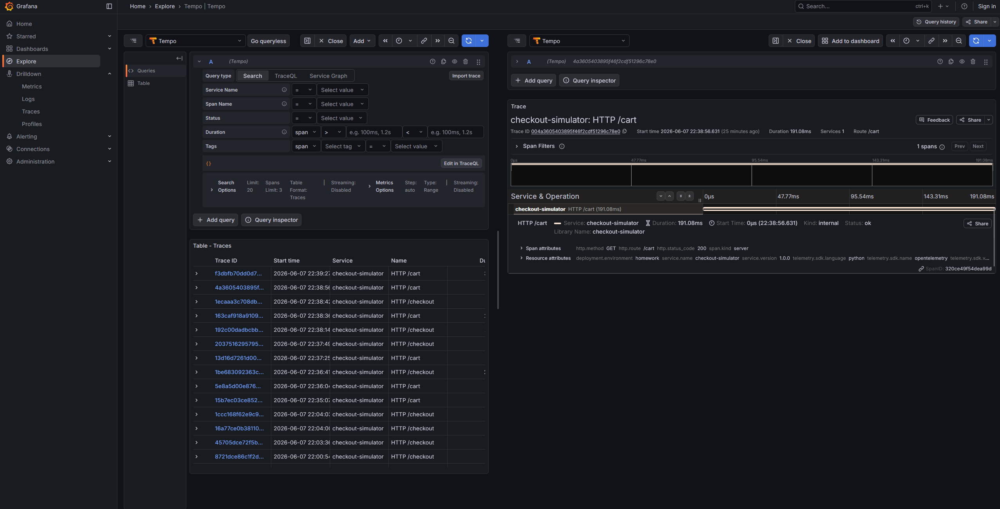
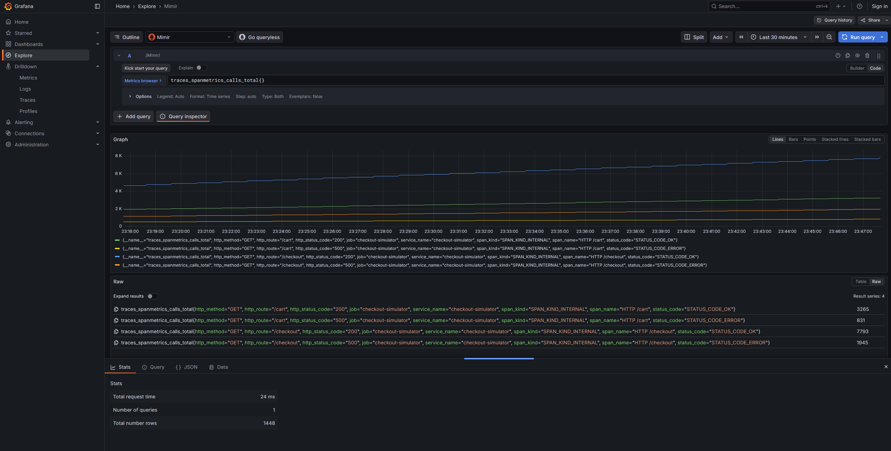
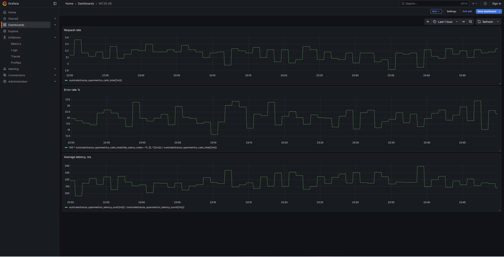

# INT26-58 — Block 7.3 — Distributed Tracing & OpenTelemetry
 
***
 
## Зміст
 
- [Архітектура рішення](#архітектура-рішення)
- [Що було налаштовано](#що-було-налаштовано)
- [Перевірка](#перевірка)
- [Дашборд](#дашборд)
- [Підтвердження](#підтвердження)
- [Definition of Done](#definition-of-done)
- [Файлова структура](#файлова-структура)
***
 
## Архітектура рішення
 
```text
tracegen ── OTLP traces ──► Alloy ──┬──► batch ──► Tempo ──► Grafana
                                    │
                                    └──► spanmetrics (RED) ──► transform ──► Mimir ──► Grafana
```
 
Alloy приймає OTLP-трейси від `tracegen` через `otelcol.receiver.otlp` (gRPC `:4317`, HTTP `:4318`) і розгалужує потік: сирі трейси через batch-процесор відправляються у Tempo, а паралельно `otelcol.connector.spanmetrics` генерує з них RED-метрики (Rate, Errors, Duration), які після перейменування пушаться у Mimir через `prometheus.remote_write`.
 
***
 
## Що було налаштовано
 
- `otelcol.receiver.otlp` — прийом трейсів (gRPC/HTTP), вихід одночасно у spanmetrics-конектор та batch-процесор.
- `otelcol.processor.batch` — батчинг сирих трейсів перед відправкою у Tempo.
- `otelcol.exporter.otlp` — форвард трейсів у Tempo.
- `otelcol.connector.spanmetrics` — генерація RED-метрик зі спанів: namespace `traces.spanmetrics` (з `endpoints.json`), dimensions `http.method`, `http.route`, `http.status_code`, explicit histogram buckets.
- `otelcol.processor.transform` — перейменування метрик під Tempo-style назви: `traces.spanmetrics.duration` → `traces.spanmetrics.latency`, `traces.spanmetrics.calls` → `traces.spanmetrics.calls.total`.
- `otelcol.exporter.prometheus` — конвертація OTLP-метрик у Prometheus-формат, `add_metric_suffixes` з `endpoints.json`, форвард у `prometheus.remote_write.mimir`.
- `prometheus.remote_write` — пуш згенерованих RED-метрик у Mimir.
***
 
## Перевірка
 
### Tempo
 
```bash
curl 'http://localhost:3200/api/search?limit=5'
```
 
### Mimir
 
```promql
traces_spanmetrics_calls_total
```
 
```promql
traces_spanmetrics_latency_count
```
 
```promql
sum(rate(traces_spanmetrics_calls_total{status_code="STATUS_CODE_ERROR"}[1m]))
```
 
***
 
## Дашборд
 
### `INT26-58`
 
Три панелі на основі згенерованих RED-метрик з Mimir:
 
- **Request rate:**
```promql
sum(rate(traces_spanmetrics_calls_total[1m]))
```
 
- **Error rate (%):**
```promql
100 *
sum(rate(traces_spanmetrics_calls_total{http_status_code=~"4..|5.."}[1m]))
/
sum(rate(traces_spanmetrics_calls_total[1m]))
```
 
- **Average latency (ms):**
```promql
sum(rate(traces_spanmetrics_latency_sum[1m]))
/
sum(rate(traces_spanmetrics_latency_count[1m]))
```
 
***
 
## Підтвердження
 
| Скріншот | Опис |
|---|---|
|  | Grafana Explore, datasource **Tempo** — список трейсів від `checkout-simulator` та відкритий трейс з деревом спанів |
|  | Grafana Explore, datasource **Mimir** — метрика `traces_spanmetrics_calls_total` з labels `http_method`, `http_route`, `http_status_code` |
|  | Dashboard `INT26-58` — панелі request rate, error rate та average latency |
 
***
 
## Definition of Done
 
- [x] У репозиторії присутній фінальний `alloy/config.alloy`.
- [x] Alloy приймає OTLP-трейси (gRPC/HTTP) від `tracegen`.
- [x] Сирі трейси через batch-процесор форвардяться у Tempo.
- [x] Spanmetrics-конектор генерує RED-метрики з dimensions `http.method`, `http.route`, `http.status_code` та histogram-блоком.
- [x] Метрики перейменовано у Tempo-style (`latency`, `calls.total`) та запушено у Mimir.
- [x] Трейси видно у Tempo (`/api/search` та Grafana Explore).
- [x] RED-метрики (`traces_spanmetrics_calls_total`, `traces_spanmetrics_latency_count`) видно у Mimir.
- [x] Створено dashboard `INT26-58 - RED` з панелями request rate, error rate та latency.
***
 
## Файлова структура
 
```text
INT26-58/
├── README.md
├── alloy/
│   └── config.alloy
├── step1/
│   ├── tempo_traces_search.png
│   └── mimir_red_metrics_query.png
└── step2/
    └── dashboard_red_panels.png
```

