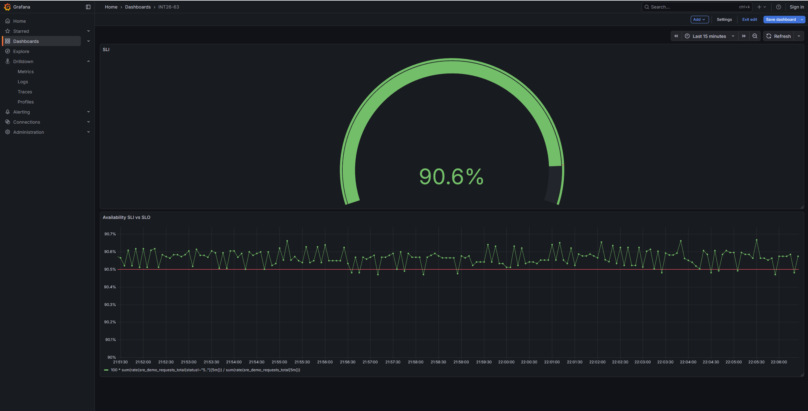

# INT26-63 — Block 9.1 — SRE Foundations
 
***
 
## Зміст
 
- [Архітектура рішення](#архітектура-рішення)
- [SLI / SLO / Error Budget](#sli--slo--error-budget)
- [Перевірка](#перевірка)
- [Дашборд](#дашборд)
- [Висновок](#висновок)
- [Підтвердження](#підтвердження)
- [Definition of Done](#definition-of-done)
- [Файлова структура](#файлова-структура)
***
 
## Архітектура рішення
 
```text
sre-demo ──/metrics──► Alloy (scrape) ──remote_write──► Mimir ──► Grafana
   ▲
loadgen ── normal / slow / failing requests
```
 
`sre-demo` віддає Prometheus-метрики на `/metrics`, `loadgen` навмисно генерує нормальні, повільні та фейлові запити. Alloy scrape-ить метрики сервісу (pull-модель) і remote-write-ом пушить їх у Mimir. Метрики вже присутні в стеку — нові не генеруються; завдання полягало у визначенні SLI, виборі SLO-цілі та її візуалізації в Grafana.
 
***
 
## SLI / SLO / Error Budget
 
**SLI (Service Level Indicator):** Availability — частка успішних (не-5xx) запитів від загальної кількості запитів, у відсотках.
 
```promql
100 *
sum(rate(sre_demo_requests_total{status!~"5.."}[5m]))
/
sum(rate(sre_demo_requests_total[5m]))
```
 
- `rate(...[5m])` — швидкість росту лічильника за останні 5 хвилин (вікно вимірювання SLI).
- `{status!~"5.."}` — успіхом вважаються всі запити, крім 5xx (2xx/3xx/4xx; 4xx — це помилки на боці клієнта, сервіс відповів коректно).
- успішні / всі × 100 — відсоток доступності.
**SLO (Service Level Objective):** availability ≥ **90.5%** за вікно **30 днів**.
 
Ціль обрано на рівні фактичної поведінки сервісу: `loadgen` навмисно тримає сталу частку фейлів, через що SLI стабільно тримається близько 90.5%. Ставити вищу, недосяжну ціль — антипатерн; SLO погоджується з реальною поведінкою системи.
 
**Error Budget = 100% − SLO = 9.5%** — допустима частка фейлових запитів за вікно SLO (30 днів). Поки фактичний error rate за вікно не перевищує 9.5% — бюджет не вичерпано і сервіс відповідає SLO. Швидкість витрачання бюджету називається burn rate.
 
Вікно `[5m]` у PromQL — це rolling-вікно вимірювання SLI (щоб графік був живим). 30 днів — це вікно оцінки SLO, за яке підбивається бюджет. Це різні речі: лінійкою міряємо щохвилини, підсумок підбиваємо за місяць.
 
***
 
## Перевірка
 
### Метрики в Mimir
 
```promql
sre_demo_requests_total
```
 
### SLI-запит (availability)
 
```promql
100 *
sum(rate(sre_demo_requests_total{status!~"5.."}[5m]))
/
sum(rate(sre_demo_requests_total[5m]))
```
 
***

## Дашборд

### `INT26-63`

Дашборд містить дві панелі на основі availability-SLI з Mimir:

**Панель «SLI»** (тип Gauge) — поточне значення availability одним числом зі шкалою:
- Query — availability-запит (нижче).
- Unit — Percent, thresholds: червоний нижче 90.5, зелений від 90.5 — gauge одразу показує, по який бік SLO ми зараз.

**Панель «Availability SLI vs SLO»** (тип Time series) — динаміка availability у часі:
- Query — той самий availability-запит.
- Unit — Percent, Min — 90 (щоб коливання біля цілі було видно).
- Threshold на рівні **90.5** з відображенням лінією (`thresholdsStyle: line`) — фізично показує межу SLO на графіку.

***
 
## Висновок
 
Поточна availability тримається на рівні **~90.5%**, тобто SLI коливається безпосередньо біля межі SLO. Сервіс **граничнo виконує SLO**: при сталому error rate ~9.5% весь error budget витрачається рівно з допустимим темпом, без запасу. Це означає, що будь-яке додаткове просідання (зростання частки 5xx) одразу штовхне SLI під ціль і почне спалювати бюджет швидше за допустимий burn rate — стан вимагає уваги і не залишає простору для ризикових релізів.
 
***
 
## Підтвердження
 
| Скріншот | Опис |
|---|---|
|  | Dashboard `INT26-63` |
 
***
 
## Definition of Done
 
- [x] Обрано SLI — Availability (частка не-5xx запитів).
- [x] Визначено SLO-ціль — 90.5% за вікно 30 днів.
- [x] Написано PromQL-запит, що вимірює SLI.
- [x] Метрики `sre_demo_requests_total` присутні в Mimir.
- [x] Побудовано Grafana-візуалізацію SLI з порогом SLO.
- [x] Надано пояснення error budget (9.5%).
- [x] Зроблено висновок щодо виконання SLO на поточний момент.
***
 
## Файлова структура
 
```text
INT26-63/
├── README.md
└── step1/
    └── dashboard_sli_availability.png
```
